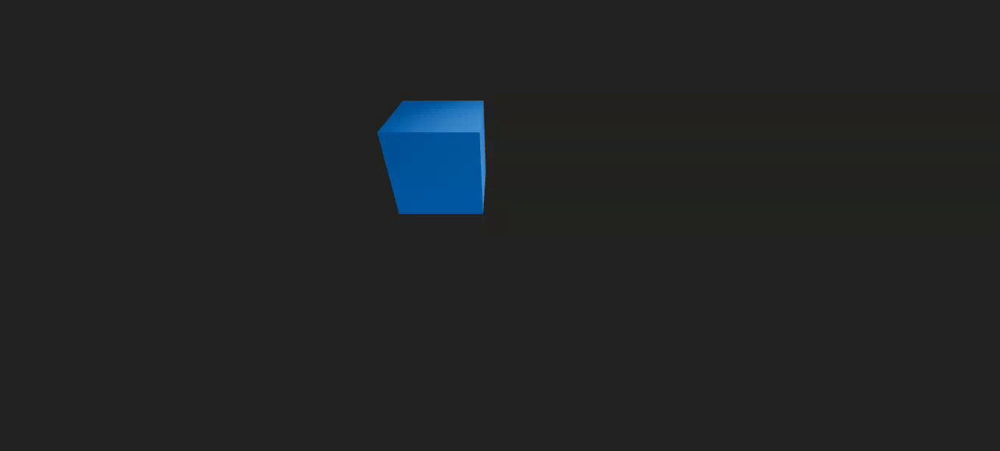

# Three.js Animation result

The final result is a 3D animation created using Three.js and React Three Fiber.
The animation features a cube that moves in a circular trajectory, rotates on its
own axis, and scales smoothly over time. The scene is interactive, allowing users
to navigate using `OrbitControls`.

The cube's position, rotation, and scale are animated using the `useFrame` hook,
which updates the properties on each frame render. The cube's scale is based on a
sine function, creating a smooth oscillation effect.

The animation is rendered in a 3D environment, providing a visually appealing and
dynamic experience. The use of `OrbitControls` allows users to explore the scene
from different angles, enhancing the interactivity of the animation.

Here's a preview of the final result:


## Scene Behaviors

All the behaviors of the cube are handled in the `useFrame` function, which is
called on every frame render. The `useFrame` function is part of the React Three
Fiber library and allows you to create animations by updating the properties of
the 3D objects in the scene.

The cube's behaviors include:

- [**Circular Movement**](#circular-movement): The cube moves in a circular
trajectory.
- [**Rotation**](#rotation): The cube rotates on its own axis.
- [**Scaling**](#scaling): The cube scales smoothly over time, creating a
pulsating effect.

### Circular Movement

The cube moves in a circular trajectory, with its position being updated based on
the sine and cosine of the current time. This creates a smooth circular motion
around the center of the scene. And it is expressed in the following code:

```js
useFrame((state) => {
  const radius = 1.5;
  const angle = state.clock.elapsedTime;

  // Move the mesh up and down in a circular motion
  meshRef.current.position.y = Math.sin(angle) * radius;
  meshRef.current.position.x = Math.cos(angle) * radius;

  //...[More code]...

});
```

### Rotation

The cube rotates on its own axis, with the rotation speed being controlled by the
`delta` time. In this case, the cube rotates around the X-axis. This is done
using the `rotation` property of the mesh. Here's the code that handles the
rotation:

```js
useFrame((_, delta) => {
  //...

  // Rotate the mesh on its own axis
  meshRef.current.rotation.x += delta;
});
```

### Scaling

The cube scales smoothly over time, creating a pulsating effect. The scale is
based on a sine function, which oscillates between 0.5 and 1.5. This is done
using the `scale` property of the mesh. The scaling effect is achieved with the
following code:

```jsx
//...

const [scale, setScale] = useState(1);

useFrame((state) => {
  //...
  const angle = state.clock.elapsedTime;
  //...

  // Scale the mesh based on its position
  // It will scale up and down between 0.5 and 1.5
  const scaleFactor = Math.abs(Math.sin(angle) / 2 + 1);
  setScale(scaleFactor);
});

return (
  <mesh scale={scale} {/* Other properties */}>
    {/* Other components */}
  </mesh>
);
```

### Interactivity

The scene is interactive, allowing users to navigate using `OrbitControls`. This
enables users to explore the 3D environment from different angles and perspectives.
The `OrbitControls` component is imported and used to enable this feature. The
controls are set up in the `Canvas` component, allowing users to rotate, zoom,
and pan the camera view. Here's the relevant code:

```jsx
import { OrbitControls } from '@react-three/drei';

// ...

function App() {
  return (
    <Canvas>
      {/* Other components */}
      <OrbitControls />
    </Canvas>
  );
}
```
