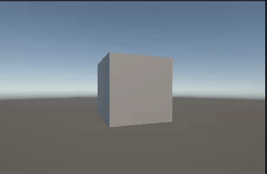

# Unity animation results

The cube in the Unity scene is animated using a combination of transformations. The cube's behavior is defined in the `CubeAnimation` script, which is attached to the cube GameObject. The script implements four main transformations: [random translation](#1-random-translation), [automatic reset](#2-automatic-reset), [constant rotation](#3-constant-rotation), and [oscillating scale](#4-oscillating-scale).

When combined, these transformations create a dynamic cube that:

- Rotates continuously around the Y axis (50 rad/s)
- Randomly jumps to new positions every 80 frames
- Returns to its starting position every 300 frames
- Continuously pulsates in size following a sine wave pattern



## Animation Effects Applied to the Cube

### 1. Random Translation

The cube randomly translates along the X and Y axes every 80 frames if
the cube is not in the process of resetting

```csharp
bool isNewFrameEvent = Time.frameCount % 80 == 0;
if (!shouldReset && isNewFrameEvent)
{
    float randomX = Random.Range(-1f, 1f);
    float randomY = Random.Range(-1f, 1f);
    transform.Translate(new Vector3(randomX, randomY, 0));
}
```

### 2. Automatic Reset

The cube returns to its initial position periodically

#### Reset implementation

```csharp
// Reset position after 300 frames
bool shouldReset = Time.frameCount % 300 == 0;

if (shouldReset)
{
    transform.position = initialPosition;
}
```

#### Visual effect for resets

Prevents the cube from drifting too far from its starting point

### 3. Constant Rotation

The cube continuously rotates around the Y axis

#### Implementation for rotation

```csharp
float rotationSpeedY = 50f; // units per second
float rotationAmount = rotationSpeedY * Time.deltaTime;
transform.Rotate(new Vector3(0, rotationAmount, 0));
```

#### Visual effect for rotation

Smooth spinning around the vertical axis

### 4. Oscillating Scale

The cube's size pulses larger and smaller continuously

#### Implementation for scaling

Uses `transform.localScale` to modify the cube's size by employing a sine wave to
modulate the scale between 0.5x and 1.5x

```csharp
float scaleFactor = 1 + Mathf.Sin(Time.time) * 0.5f;
transform.localScale = new Vector3(scaleFactor, scaleFactor, scaleFactor);
```

#### Visual Effect

Breathing-like pulsation that enlarges and shrinks the cube
