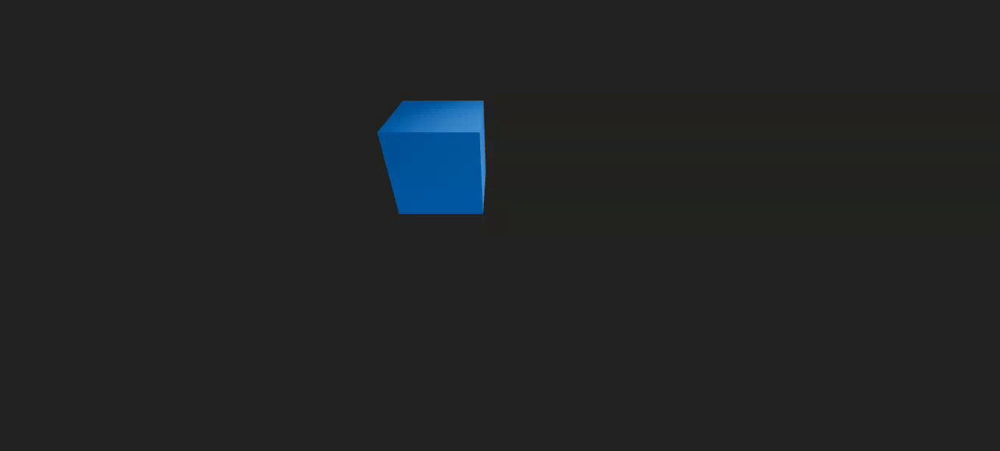

# Three.js Animation result

The final result is a 3D animation created using Three.js and React Three Fiber.
The animation features a cube that moves in a circular trajectory, rotates on its
own axis, and scales smoothly over time. The scene is interactive, allowing users
to navigate using `OrbitControls`.

The cube's position, rotation, and scale are animated using the `useFrame` hook,
which updates the properties on each frame render. The cube's scale is based on a
sine function, creating a smooth oscillation effect.

The animation is rendered in a 3D environment, providing a visually appealing and
dynamic experience. The use of `OrbitControls` allows users to explore the scene
from different angles, enhancing the interactivity of the animation.

Here's a preview of the final result:

