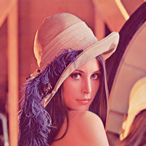

# Workshop - Analysis of Geometric Shapes: Centroid, Area, and Perimeter

## Date

2025-05-08

## Workshop Objective

Detect simple shapes (circles, squares, triangles) in binarized images and calculate
geometric properties such as area, perimeter, and centroid. The objective is to
develop skills to extract relevant metrics from detected contours in processed images.

## Concepts Learned

- Image Contours: Understanding how OpenCV detects and represents shape boundaries
- Geometric Properties:
  - Area calculation for irregular shapes
  - Perimeter measurement using contour points
  - Centroid computation from contour moments
- Binary Image Processing:
  - Thresholding techniques for shape detection
  - Contour detection in binary images
- Shape Analysis:
  - Contour approximation methods
  - Shape classification based on geometric properties
  - Moment calculations for shape features

## Tools and Environments

- Python 3.13.2
  - `opencv-python`: For image processing and computer vision tasks.
  - `numpy`: For numerical operations and array manipulations.
  - `imageio`: For creating GIF images.
  - `IPython`: For displaying images in Jupyter notebooks.
- Visual Studio Code: for editing, running and debugging Python code.

## Implementation

### Stages performed

1. Image Preprocessing
    - Loading and converting image to grayscale
    - Binary thresholding to separate shapes from background

2. Contour Detection
    - Finding contours using `cv2.findContours()`
    - Approximating contours to identify shape type

3. Geometric Analysis
    - Computing area using `cv2.contourArea()`
    - Calculating perimeter with `cv2.arcLength()`
    - Finding centroids through moment calculations

4. Visualization
    - Drawing contours on the original image
    - Marking centroids and shape properties
      - Index of the contour drawn as blue text
      - Area drawn as blue text
      - Perimeter drawn as blue text
      - Centroid coordinates `(x, y)` drawn as red text
      - Centroid position drawn as a red circle
    - Creating animated GIF to show analysis process

### Relevant Code Snippets

```python
# Image preprocessing
img = cv2.imread('../data/Lenna.png')
img_gray = cv2.cvtColor(img, cv2.COLOR_BGR2GRAY) # Convert to grayscale
_, thresh = cv2.threshold( # Convert to binary with thresholding
    img_gray,
    127,
    255,
    cv2.THRESH_BINARY,
)

# Contour detection
contours, hierarchy = cv2.findContours(
    thresh,
    cv2.RETR_TREE,  # Retrieves all contours and reconstructs a full hierarchy of nested contours
    cv2.CHAIN_APPROX_SIMPLE,  # Reduces the number of points in the contour
)

# Geometric analysis storing in a dataclass
@dataclass
class ContourInfo:
    area: float
    perimeter: float
    centroid: tuple[int, int] | None
    raw: cv2.typing.MatLike

contours_info = [
    ContourInfo(
        area=cv2.contourArea(c),
        perimeter=cv2.arcLength(c, True),
        centroid=(
            int(moments['m10'] / moments['m00']),
            int(moments['m01'] / moments['m00']),
        ),
        raw=c,
    )
    for c in contours
]
```

## Visual Results

### Original image



### Contours and properties

> [!NOTE]
> The red circle indicates the centroid of the shape, while the blue text shows the index
> of the contour, area, perimeter, and the red text shows the centroid coordinates.


