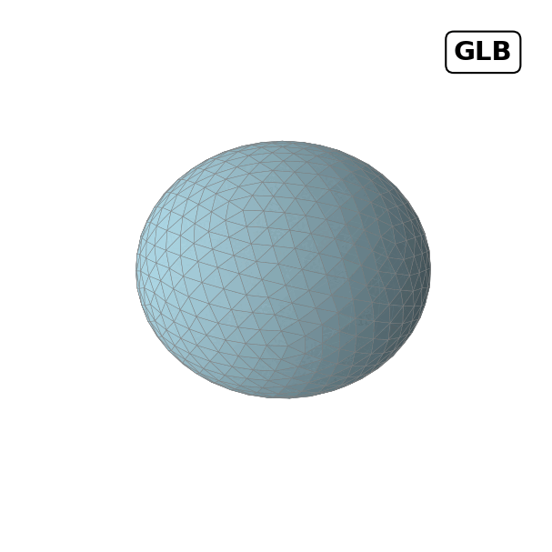

# Taller - Visualización y Conversión de Formatos 3D

##  Date
2025-05-08

---

##  Objective

Understand and demonstrate how to convert 3D models between formats using Python, and how to visualize them interactively in a web browser using Three.js and React.

---

##  Folder Structure

2025-05-08_taller_conversion_formatos_3d/
├── python/ # Part 1: Python - Format conversion
│ └── format_conversion_meshes.ipynb
├── threejs/ # Part 2: React + Three.js viewer
│ └── viewer-threejs/
├── README.md # This file

---

##  Part 1 – Python + Trimesh

- Created an icosphere model using `trimesh`
- Converted and exported it to:
  - `.obj`
  - `.stl`
  - `.glb` (binary glTF)
- Compared number of vertices, faces, and watertight status
- Generated labeled PNG renders
- Created a GIF slideshow comparing the three formats

**Colab notebook:**  
👉 [Open in Google Colab](https://colab.research.google.com/drive/1a5r7JbXXLGiw3eJfq7v5zlrcIQMFI4ML?usp=sharing)

---

##  Part 2 – Three.js Viewer (React)

Built an interactive 3D viewer using:
- `React` + `Vite`
- `@react-three/fiber` for rendering
- `@react-three/drei` for helpers like `OrbitControls`
- `three-stdlib` for `OBJLoader` and `STLLoader`

### Features:
- Loads `.obj`, `.stl`, and `.glb` models from the `/public/models/` folder
- Switch between formats with UI buttons
- Real-time 3D interaction (rotate, zoom, pan)
- Current format displayed as a label

---

##  Tools Used

- Python 3.11 + Trimesh
- Google Colab
- React + Vite
- Three.js / React Three Fiber
- STLLoader, OBJLoader, GLTFLoader

---

##  Visual Results (Optional)

### threejs

### python

Gif comparison

---

##  Summary

This workshop demonstrated both backend and frontend workflows for working with 3D models. Python was used for creation and conversion of formats, while React and Three.js enabled interactive online visualization of the same models in `.OBJ`, `.STL`, and `.GLB` formats.
