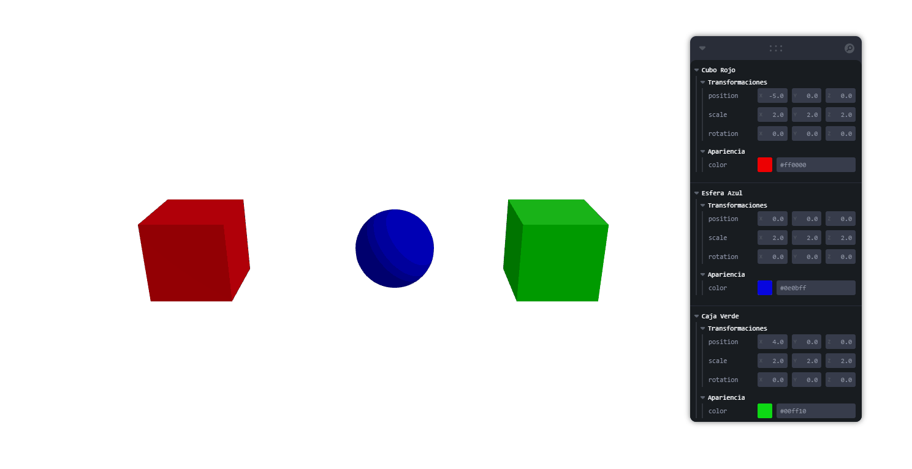
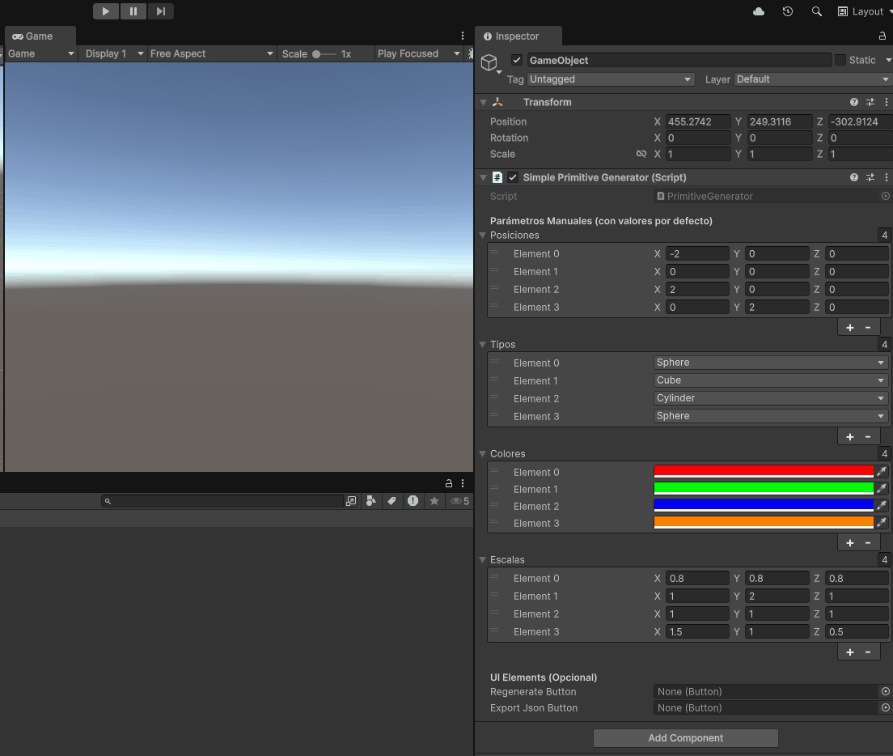

# 🧱 Generación Programada de Objetos 3D

Este proyecto explora la creación de objetos 3D de manera programada a partir de listas de coordenadas y datos estructurados. El objetivo es comprender cómo construir geometría de forma dinámica y parametrizada, aprovechando estructuras de control como bucles y condicionales. Las escenas generadas pueden visualizarse en tiempo real y exportarse en formatos estándar.

---

## 🔹 Entornos y Actividades

### 🌐 Three.js con React Three Fiber

**Escenario:**

- Se creó una escena 3D en tiempo real usando React Three Fiber.
- Se usó un array de datos para generar múltiples objetos con `map()`.
- Los objetos se parametrizaron en **posición, escala, rotación y color** a partir de los datos.
- Se aplicaron condicionales para adaptar la forma y atributos de cada objeto.
- Se integró [Leva](https://leva.pmnd.rs/) para manipulación en vivo de parámetros desde la interfaz.

**📸 Vista previa:**

---

### 🎮 Unity (C#)

**Escenario:**

- Se desarrolló un script en C# que genera objetos 3D como esferas, cubos o cilindros en tiempo de ejecución con `GameObject.CreatePrimitive()`.
- Se usaron listas de coordenadas para instanciar múltiples objetos en escena.
- Se aplicaron condiciones para alternar el tipo, color y tamaño según el índice o el valor de los datos.

**📸 Vista previa:**

---

## ✅ Prompts y Exportaciones

- En caso de utilizar Python o Blender, se puede exportar la geometría generada a formatos como `.OBJ`, `.STL` o `.GLTF`.
- Este proyecto no se basó en prompts de IA, pero podría integrarse en fases futuras para generación procedimental de datos.

---

## 🧠 Reflexiones y Mejoras

- **Dificultades:** Manejo de coordenadas y transformaciones espaciales, así como sincronización visual entre datos y geometría.
- **Posibles mejoras:** Añadir animaciones, interactividad más avanzada, exportaciones desde el navegador, y generación desde datos externos (CSV, JSON, APIs).

---

