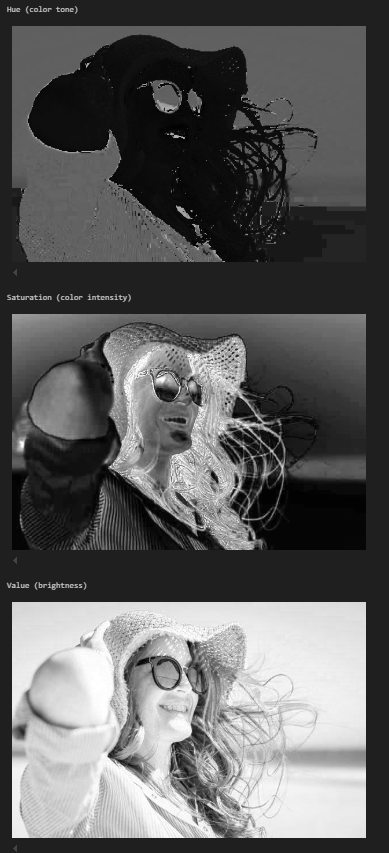
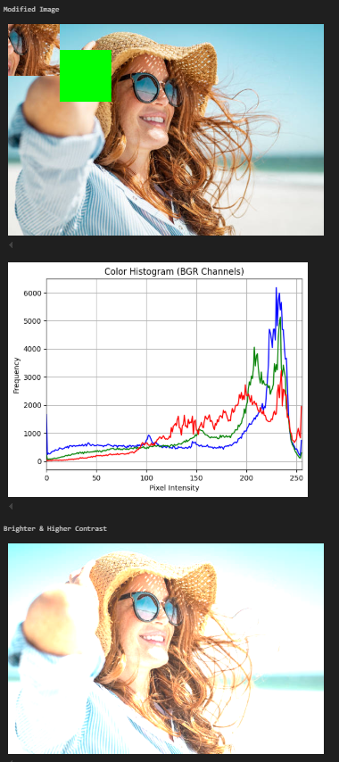

# Image Matrix Workshop – Pixels as Data

## Date
2025-05-08

---

## Objective

Understand how digital images are represented as matrices and learn to manipulate regions, color channels, and intensity using OpenCV and NumPy.

---

## Tools

- Python (OpenCV, NumPy, Matplotlib)
- Google Colab

Notebook link:  
[Open in Colab](https://colab.research.google.com/drive/1qBCl9NB97p1rWTSoK2pm0S0NAUVekztj?usp=sharing)

---

## Tasks Completed

- Loaded a color image with `cv2.imread()`
- Displayed RGB and HSV channels separately
- Modified a rectangular region (color fill)
- Replaced one region with another
- Plotted histograms for each color channel
- Adjusted brightness and contrast with `convertScaleAbs()`

---

## Visual Results

Results:
Image channel outputs:

Additional modifications:

These are saved in the `/results/` folder.

---

## Reflection

This workshop clarified how images work as matrices and how easy it is to manipulate pixels directly. Visualizing channels and adjusting regions helped reinforce pixel-level understanding of image data.

---

## Checklist

- [x] Functional notebook in Colab
- [x] Visual results included
- [x] Clear and concise README
