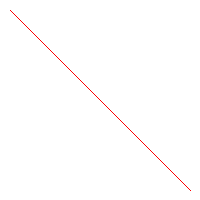
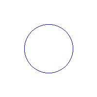
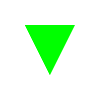

# Workshop - Rasterization from Scratch: Drawing with Classic Algorithms

## Date

2025-05-08

## Workshop Objective

To understand and implement classic rasterization algorithms for lines, circles,
and triangles, understanding how images are built pixel by pixel on a screen.
The objective is to develop a solid foundation on how graphic primitives
are generated without using high-level libraries.

## Concepts Learned

- Rasterization
- Classic rasterization algorithms
  - Bresenham for lines
  - Midpoint for circles
  - Scanline for triangles

## Tools and environments

- Python 3.13.2 (Jupyter Notebook)
  - Pillow: to create and manipulate images
  - numpy: for numerical operations
  - IPython: for interactive Python sessions
- Visual Studio Code: for code editing and debugging

## Project Structure

```plaintext
2025-05-08_taller_rasterizacion_desde_cero
├── python
│   ├── main.ipynb # Jupyter Notebook with the implementation of the algorithms
│   └── requirements.txt # Prerequisites for the Python environment
├── .python-version # Python version for pyenv
├── README.md
├── results # Directory to store the results of the algorithms
│   ├── circle.png
│   ├── line.png
│   └── triangle.png
└── .vscode
    └── settings.json # VSCode settings for Python environment
```

## Algorithms implemented

### Bresenham's Line Algorithm

A highly efficient line-drawing algorithm that uses only integer arithmetic to determine which pixels to illuminate when drawing a line between two points. It minimizes the use of floating-point calculations by using an error-correction method to decide which pixels to plot.

```python
def bresenham(pixel, x0: int, y0: int, x1: int, y1: int, color: Color = (255, 0, 0)) -> None:
    dx = abs(x1 - x0)
    dy = abs(y1 - y0)
    sx = 1 if x0 < x1 else -1
    sy = 1 if y0 < y1 else -1
    err = dx - dy

    while True:
        pixel[x0, y0] = color
        if x0 == x1 and y0 == y1:
            break
        err2 = err * 2
        if err2 > -dy:
            err -= dy
            x0 += sx
        if err2 < dx:
            err += dx
            y0 += sy
```

### Midpoint Circle Algorithm

An efficient algorithm for drawing circles using only integer arithmetic. It determines which pixels to plot by examining the midpoint between potential pixels, using the circle's symmetry to reduce calculations. Only one octant needs to be calculated, with the other seven derived through symmetry.

```python
def midpoint_circle(pixel, size: tuple[int, int], x0: int, y0: int, radius: int, 
                   color: DrawingColor = (0, 0, 255)) -> None:
    x = radius
    y = 0
    err = 1 - radius
    width, height = size

    while x >= y:
        for dx, dy in [
            (x, y), (y, x), (-x, y), (-y, x),
            (-x, -y), (-y, -x), (x, -y), (y, -x),
        ]:
            if 0 <= x0 + dx < width and 0 <= y0 + dy < height:
                pixel[x0 + dx, y0 + dy] = color
        y += 1
        if err <= 0:
            err += 2 * y + 1
        else:
            x -= 1
            err += 2 * (y - x) + 1
```

### Fill triangle algorithm (scanline algorithm)

A method for filling triangles by scanning horizontally across each row (scanline) that intersects the triangle. For each scanline, it finds the intersection points with the triangle's edges and fills all pixels between these points. The algorithm uses interpolation to determine the exact intersection points.

```python
def fill_triangle(pixels, size: tuple[int, int], p1: tuple[int, int], 
                 p2: tuple[int, int], p3: tuple[int, int], 
                 color: Color = (0, 255, 0)) -> None:
    # Sort vertices by y-coordinate
    pts = sorted([p1, p2, p3], key=lambda p: p[1])
    (x1, y1), (x2, y2), (x3, y3) = pts
    width, height = size

    def interpolate(y0: int, y1: int, x0: int, x1: int) -> list[int]:
        if y1 == y0:
            return []
        return [
            int(x0 + (x1 - x0) * (y - y0) / (y1 - y0))
            for y in range(y0, y1)
        ]

    x12 = interpolate(y1, y2, x1, x2)
    x23 = interpolate(y2, y3, x2, x3)
    x13 = interpolate(y1, y3, x1, x3)

    x_left = x12 + x23
    for y, xl, xr in zip(range(y1, y3), x13, x_left):
        for x in range(min(xl, xr), max(xl, xr)):
            if 0 <= x < width and 0 <= y < height:
                pixels[x, y] = color
```

## Results

### Line



### Circle



### Triangle



## Analysis

The three implemented algorithms showcase different approaches to rasterization, each with its own advantages and trade-offs:

### Performance Comparison

1. **Bresenham's Line Algorithm**
   - Most efficient for line drawing
   - Uses only integer arithmetic (no floating-point operations)
   - Minimal memory usage
   - Perfect pixel-perfect precision
   - O(max(dx, dy)) complexity

2. **Midpoint Circle Algorithm**
   - Efficient for circles due to 8-way symmetry
   - Integer-only arithmetic
   - Very precise for circles
   - O(r) complexity where r is radius
   - More complex than line drawing but optimized through symmetry

3. **Scanline Triangle Fill**
   - Most complex of the three
   - Uses floating-point arithmetic for interpolation
   - Requires sorting and multiple passes
   - O(n) complexity where n is triangle area
   - Most memory intensive due to interpolation arrays

### Precision vs Speed

- Bresenham and Midpoint algorithms achieve perfect precision with integer math
- Scanline algorithm trades some precision for filling capability
- All three avoid anti-aliasing for performance

### Memory Usage

- Line: Constant memory O(1)
- Circle: Constant memory O(1)
- Triangle: Linear memory O(height) for scan buffers
