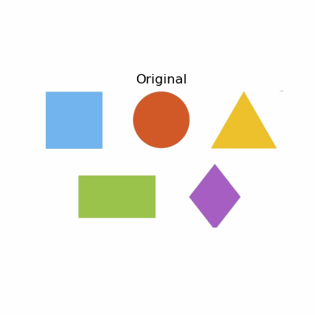

# Segmentación Animada de Imágenes

Este proyecto muestra un flujo completo de segmentación de imágenes mediante OpenCV y la generación de un GIF animado que ilustra cada etapa del proceso.

---

## Descripción del Proceso

1. **Carga de la imagen** en color y conversión a escala de grises.  
2. **Segmentación binaria** combinando:  
   - Umbral fijo (`cv2.threshold`) para resaltar las regiones brillantes.  
   - Umbral adaptativo (`cv2.adaptiveThreshold`) para manejar variaciones de iluminación.  
3. **Combinación de máscaras** con `cv2.bitwise_or` para obtener una segmentación más robusta.  
4. **Detección de contornos** con `cv2.findContours`.  
5. **Filtrado de ruido** descartando contornos pequeños (menos del 0.2% del área total).  
6. **Análisis de cada contorno**:  
   - Cálculo de momentos para obtener centroides.  
   - Cajas delimitadoras (`boundingRect`).  
   - Dibujo de contorno (verde), centroide (azul) y caja (roja).  
7. **Generación del GIF animado** (librería `imageio`): tres frames secuenciales:  
   - Frame 1: *Imagen original*.  
   - Frame 2: *Imagen segmentada*.  
   - Frame 3: *Resultado con contornos, centroides y cajas*.  

---

## GIFs Animados

  

---

## Dificultades y Aprendizaje

Este tema es muy amplio y abstracto

Aprender a combinar umbrales y a filtrar contornos requirió entender bien la teoría de momentos y técnicas de preprocesamiento.

En conjunto, ha sido un reto significativo pero muy enriquecedor para consolidar conceptos de visión por computador.

