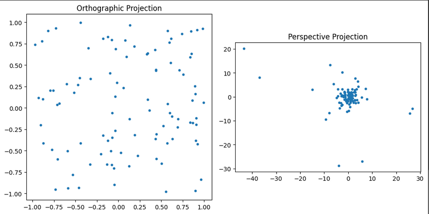
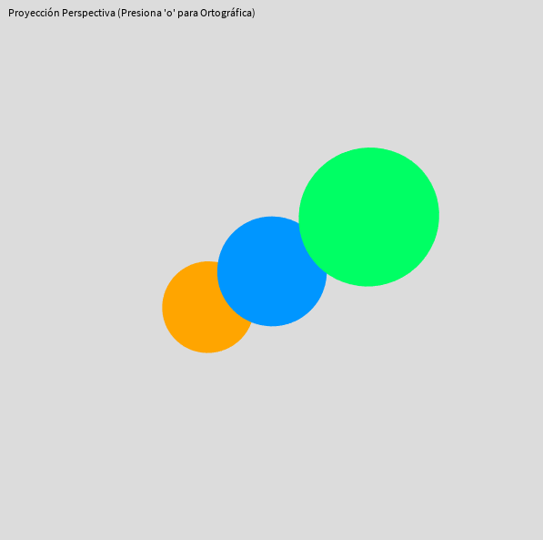
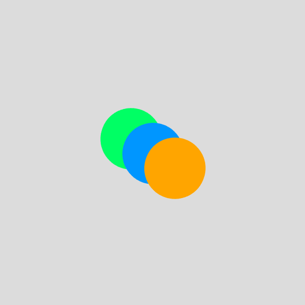

# Project: Visualizing Orthographic and Perspective Projections in 3D

This project demonstrates the difference between orthographic and perspective projections using multiple technologies:

- **Python:** Generates 3D points and visualizes their 2D projections using matrices.  
- **Processing:** Interactive 3D sketch that lets you switch between orthographic and perspective cameras with rotating spheres.  
- **Three.js (React):** Web app with routes showing scenes rendered with orthographic and perspective cameras, including user controls.  
- **Unity:** *(Pending)* Intended to have a 3D scene with camera switching.

## Project Structure

- `/python`: Python scripts using NumPy and Matplotlib for projection visualizations.  
- `/processing`: Processing sketches for interactive 3D visualization.  
- `/threejs`: React application using React Three Fiber and React Router.  
- `/unity`: Placeholder folder for future Unity implementation.

## Expected Results and Deliverables

### Python

### Processing

perspective view

orthographic view

### Three.js

PENDING
- Screenshots (`PNG`) of the scene rendered with orthographic and perspective cameras (two separate images).  
- 

## Conclusion

This project provides practical, visual comparisons of orthographic versus perspective projections across different programming environments, helping to intuitively understand the effects of projection types on 3D visualization.

Thank you for reviewing this project!

