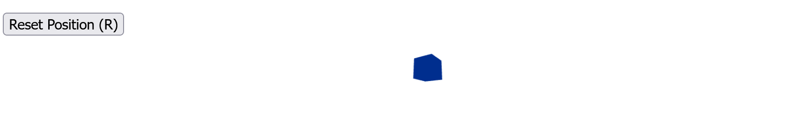
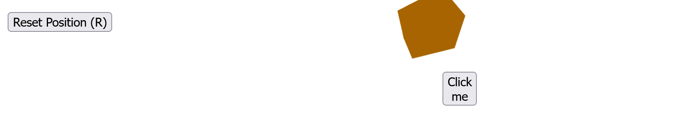
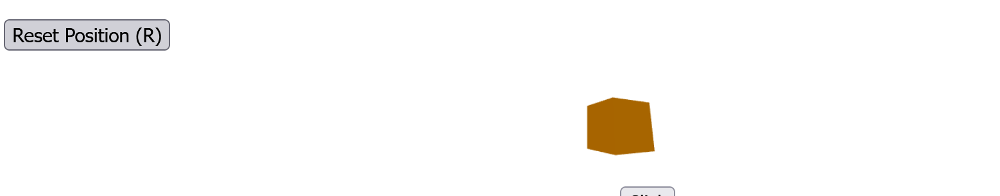
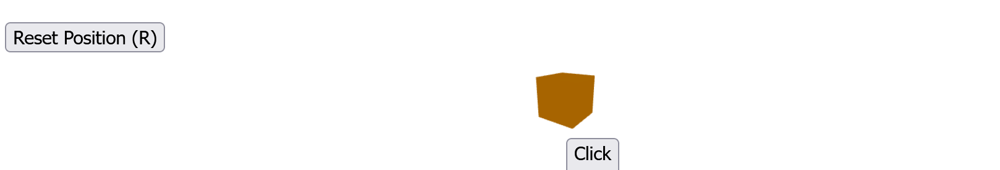

# Workshop: User Input and UI in Three.js (React)

This project demonstrates handling user input and creating interactive UI components using React with Three.js (React Three Fiber).

---

## Objective

- Visualize a 3D cube that continuously rotates.  
- Handle mouse clicks on the cube to toggle an internal UI button.  
- Handle keyboard input (the `r` key) and an external UI button to reset the cube’s position to the origin.  
- Display a UI button inside the 3D scene that triggers an alert when clicked.

---

## Project Structure

- `/threejs`: React project created with Create React App and using React Three Fiber and Drei libraries.  
- Key files:  
  - `src/App.js` — main React component implementing the 3D scene, input handling, and UI.

---

## How to Run

1. Navigate to the `/threejs` folder.  
2. Run `npm install` to install dependencies.  
3. Run `npm start` to launch the development server.  
4. Open your browser to `http://localhost:3000` to view and interact with the scene.

---

## Results and Expected Visuals

### 1. Rotating Cube

- A 3D cube rotates continuously in the scene.
- - 

### 2. Click Interaction

- Clicking the cube toggles an internal UI button above the cube.
- 

### 3. UI Button inside Scene

- When visible, the UI button can be clicked to display an alert message.

### 4. Reset Cube Position

- Pressing the `r` key on the keyboard or clicking the external "Reset Position (R)" button resets the cube’s position back to the origin `[0,0,0]`.  
- After moving to random positions on click, the reset functionality returns the cube to the center.
- 
- 

---

