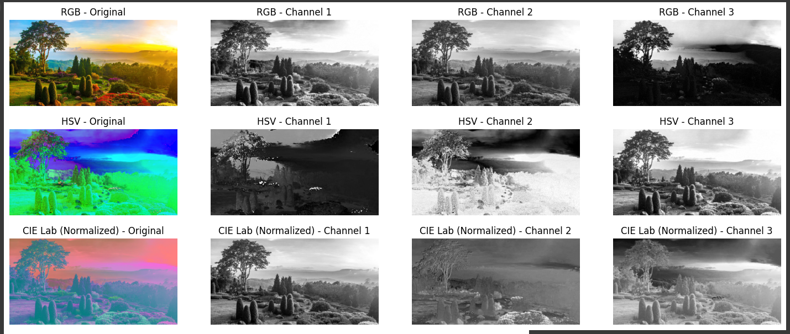
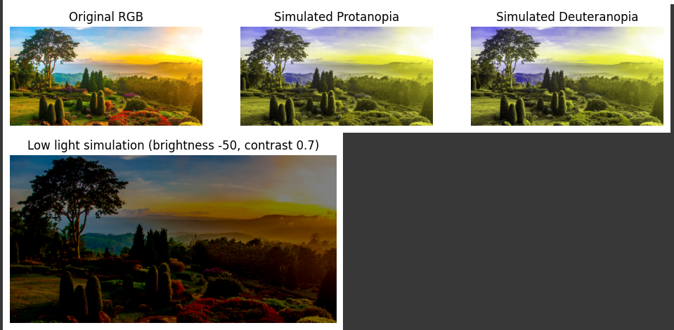

# Color Models and Human Perception Visualization

This project explores different color models and human color perception through image processing and visualization using Python.

---

## Objective

- Understand and visualize the RGB, HSV, and CIE Lab color spaces.  
- Simulate common types of color vision deficiencies (color blindness): Protanopia and Deuteranopia.  
- Explore image appearance under low light conditions by adjusting brightness and contrast.

---

## Project Structure

- 
- Interactive version available on Google Colab:  
  [Color Perception Colab Notebook](https://colab.research.google.com/drive/1tMutmQAVRGfEBTxtwH-w1X7FVqgyrmmT?usp=sharing)

---

## Results

---

## Example Image Used

- Landscape photo from:  
  `https://concepto.de/wp-content/uploads/2015/03/paisaje-2-e1549600987975.jpg`

---

## Conclusion

This project demonstrates the practical use of Python for visualizing and understanding complex color models and human color perception phenomena, including color vision deficiencies and lighting conditions.

---

Thank you for reviewing this project!
