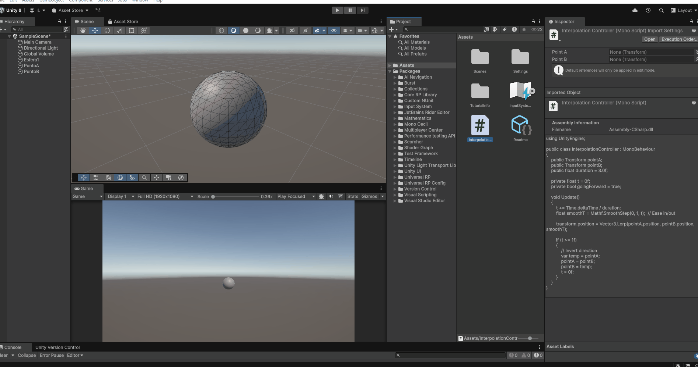
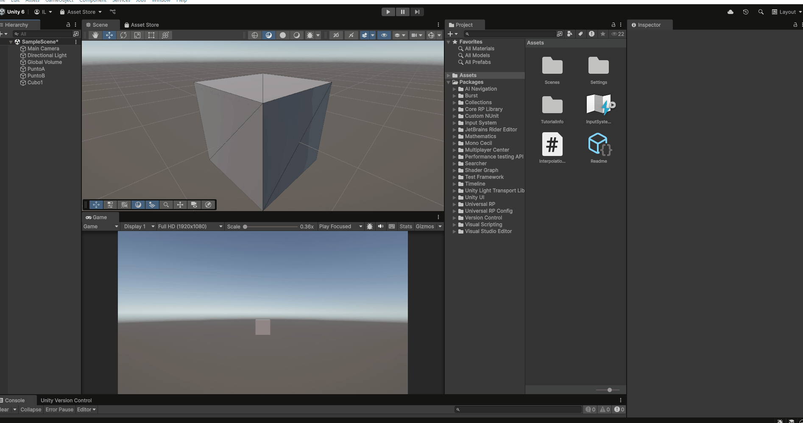
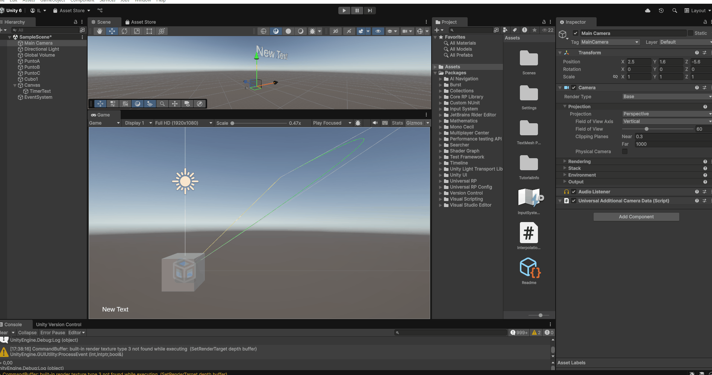

# 🧪 Taller - Interpolación de Movimiento: Suavizando Animaciones en Tiempo Real

---

## 🎮 Entorno Unity

Este taller muestra cómo suavizar animaciones de una esfera que se mueve entre dos puntos en 3D utilizando distintos tipos de interpolación.

---

## 🧠 Interpolaciones usadas

### 🔹 LERP (Linear Interpolation)
Interpolación lineal usada con `Vector3.Lerp()` para mover suavemente la posición entre dos puntos.

### 🔹 SLERP (Spherical Linear Interpolation)
Interpolación esférica con `Quaternion.Slerp()` para lograr transiciones suaves en la rotación.

### 🔹 Bézier (Curva Cuadrática)
Interpolación entre 3 puntos usando una fórmula de curva de Bézier personalizada:

---

## GIFs Animados

---

## Autor
Iván David Molina Leguízamo