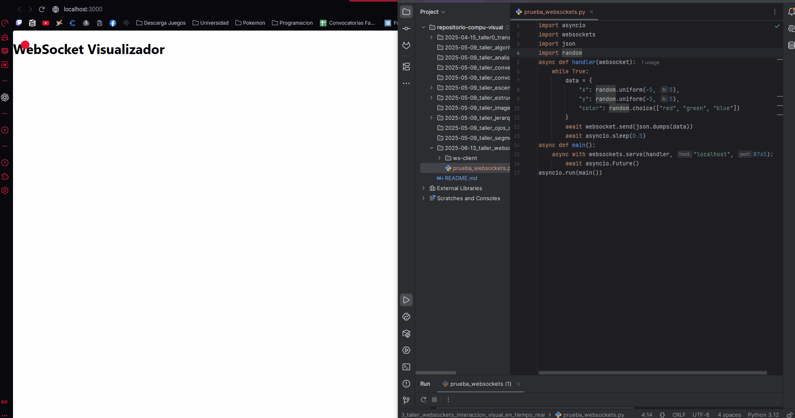
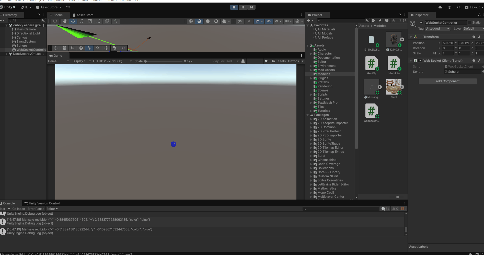

# 🧪 Taller - Taller WebSockets e interacción visual en tiempo real

## 🎮 Entorno Threejs y Unity

Este taller muestra como podemos generar servicios para proporcionar informacion constante a la parte grafica ya sea en unity o three.

## GIFs Animados

## Autores
Harrison Stiven Pinto Marulanda
Luis Gabriel Marin Muñoz
Juan Diego Lozano Colmenares
Sergio David Motta Romero
Iván David Molina Leguízamo