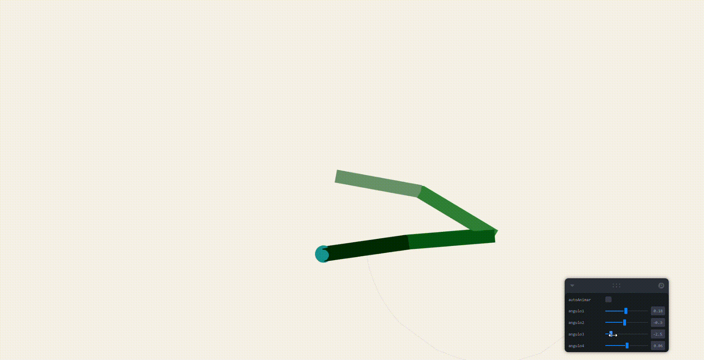

#  Taller – Cinemática Directa: Animando Brazos Articulados

##  Fecha
`2025-06-26` – Fecha de entrega

---

##  Objetivo del Taller

Aplicar los conceptos de cinemática directa (forward kinematics) para construir y animar un brazo robótico jerárquico, con control interactivo de las articulaciones y visualización de la trayectoria de su extremo.

---

## Conceptos Aprendidos

- [x] Transformaciones geométricas (escala, rotación, traslación)
- [ ] Segmentación de imágenes
- [ ] Shaders y efectos visuales
- [ ] Entrenamiento de modelos IA
- [ ] Comunicación por gestos o voz
- [x] Otro: Cinemática directa con estructuras jerárquicas en 3D

---

##  Herramientas y Entornos

- Three.js / React Three Fiber
- Leva (interfaz de sliders)
- Vite
- Navegador web moderno (Chrome/Firefox)

---

##  Estructura del Proyecto

```
2025-06-26_taller_cinematica_directa_fk/
├── threejs/               # Proyecto Vite + R3F
├── resultados/            # capturas, métricas, gifs
├── README.md              # documentación del taller
```

---

##  Implementación

### 🔹 Etapas realizadas
1. Inicialización de proyecto con Vite y React.
2. Instalación de librerías: `three`, `@react-three/fiber`, `@react-three/drei`, `leva`.
3. Creación de la jerarquía de 4 articulaciones con grupos anidados.
4. Implementación de control por sliders (`Leva`) y animación automática.
5. Cálculo de posición global del extremo.
6. Visualización de trayectoria mediante una `BufferGeometry` actualizable.
7. Cambios de fondo y colores para personalización visual.

### 🔹 Código relevante

```js
useFrame(({ clock }) => {
  const t = clock.getElapsedTime()
  baseRef.current.rotation.z = autoAnimar ? Math.sin(t) : angulo1
  articulacion2Ref.current.rotation.z = autoAnimar ? Math.sin(t * 1.5) : angulo2
  articulacion3Ref.current.rotation.z = autoAnimar ? Math.sin(t * 2) : angulo3
  articulacion4Ref.current.rotation.z = autoAnimar ? Math.sin(t * 2.5) : angulo4

  const pos = new THREE.Vector3()
  manoRef.current.getWorldPosition(pos)
  trayectoria.current.push(pos.clone())
  if (trayectoria.current.length > 100) trayectoria.current.shift()

  const geom = new THREE.BufferGeometry().setFromPoints(trayectoria.current)
  lineaRef.current.geometry.dispose()
  lineaRef.current.geometry = geom
})
```

---

##  Resultados Visuales

>  Se incluye un GIF obligatorio mostrando la ejecución y la trayectoria del brazo.


---

##  Prompts Usados

```text
"Explícame paso a paso cómo inicializar un proyecto React + Vite sin TypeScript, e instalar Three.js y React Three Fiber."
"Crea un código en JavaScript que renderice un brazo articulado con cuatro articulaciones jerárquicas en React Three Fiber, controlables por sliders y que dibuje la trayectoria de su extremo."
```

---

##  Reflexión Final

Este taller me permitió comprender cómo se estructura y anima una jerarquía de objetos 3D usando cinemática directa. Aprendí  a controlar cada articulación manual o automáticamente mediante sliders interactivos.


---

##  Checklist de Entrega

- [x] Carpeta `2025-06-26_taller_cinematica_directa_fk`
- [x] Código limpio y funcional
- [x] GIF incluido con nombre descriptivo
- [x] Visualizaciones exportadas correctamente
- [x] README completo y claro
- [x] Commits descriptivos en inglés
