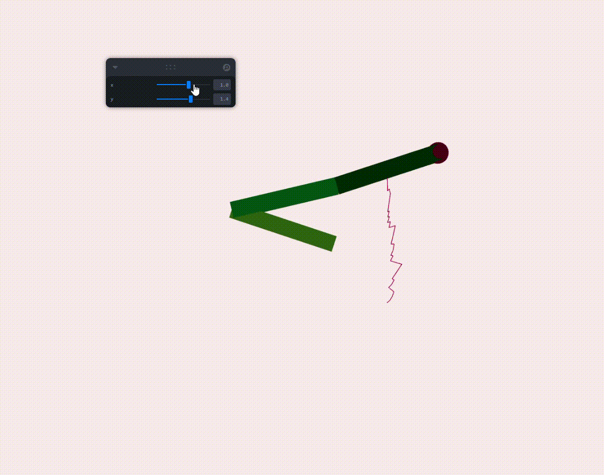

#  Cinemática Inversa - Taller IK

##  Fecha
`2025-06-27`

---

##  Objetivo del Taller

Explorar la implementación de un brazo robótico en 2D controlado mediante cinemática inversa (IK), usando React Three Fiber. El objetivo es que el brazo siga un punto objetivo en tiempo real, con trayectoria visible.

---

##  Conceptos Aprendidos

- [x] Transformaciones geométricas (rotación, traslación)
- [ ] Segmentación de imágenes
- [ ] Shaders y efectos visuales
- [ ] Entrenamiento de modelos IA
- [ ] Comunicación por gestos o voz
- [ ] Otro: Cinemática inversa (IK)

---

##  Herramientas y Entornos

- Three.js / React Three Fiber
- Leva
- JavaScript + Vite

---

##  Estructura del Proyecto

```
2025-06-27_taller_cinematica_inversa/
├── threejs/             # implementación de React Three Fiber
├── resultados/          # capturas y gif animado
├── README.md
```

---

##  Implementación

### 🔹 Etapas realizadas
1. Creación de proyecto Vite con React.
2. Instalación de librerías (@react-three/fiber, drei, leva).
3. Implementación de brazo articulado con IK por método CCD.
4. Control del objetivo vía sliders.
5. Visualización del brazo y su trayectoria.

###  Código relevante

```js
// Fragmento de rotación en CCD
const angle = Math.acos(THREE.MathUtils.clamp(toEnd.dot(toTarget), -1, 1))
const cross = toEnd.cross(toTarget)
joint.current.rotation.z += cross > 0 ? angle : -angle
```

---

##  Resultados Visuales

> .


---

##  Prompts Usados

```text
"How to implement inverse kinematics with CCD in React Three Fiber?"
"Create a robotic arm with 3 segments that follows a target using sliders"
```

---

##  Reflexión Final

Este taller permitió entender a fondo cómo funciona la cinemática inversa en sistemas gráficos, especialmente el algoritmo CCD. Fue interesante traducir los vectores de dirección en rotaciones reales y ver el efecto acumulado en tiempo real. También se reforzaron habilidades con geometría en Three.js y uso de hooks en React.

La parte más desafiante fue la gestión correcta del sistema de referencia local y mundial en cada articulación, y el ajuste del orden en que se aplican las rotaciones.


---

##  Checklist de Entrega

- [x] Carpeta `2025-06-27_taller_cinematica_inversa`
- [x] Código funcional con 3 articulaciones
- [x] GIF con trayectoria del brazo
- [x] README completo
- [x] Commits claros en inglés

---
