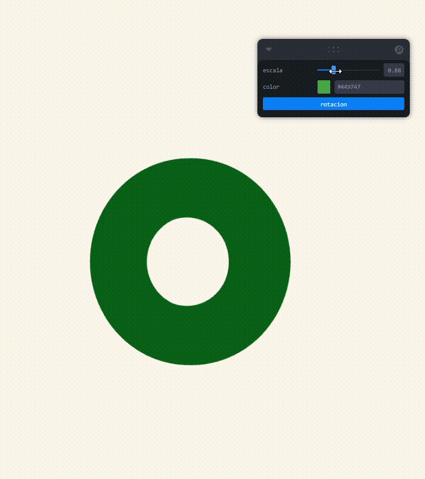

# Taller – Dashboards Visuales 3D con Sliders y Botones

##  Fecha
`2025-06-27`

---

##  Objetivo del Tallerv

Explorar la creación de paneles de control interactivos (dashboards) para escenas 3D, permitiendo modificar atributos visuales y de comportamiento en tiempo real usando controles como sliders y botones, integrados con React Three Fiber y Leva.

---

##  Conceptos Aprendidos

- [x] Transformaciones geométricas
- [ ] Segmentación de imágenes
- [ ] Shaders y efectos visuales
- [ ] Entrenamiento de modelos IA
- [ ] Comunicación por gestos o voz
- [x] Otro: Interfaces interactivas con Leva

---

##  Herramientas y Entornos

- React Three Fiber (Three.js)
- Leva (interfaz interactiva)
- Vite (entorno de desarrollo)
- Navegador web moderno

---

##  Estructura del Proyecto

```
2025-06-27_taller_dashboards_visuales_3d_sliders_botones/
├── threejs/             # Proyecto interactivo en R3F
├── resultados/          # capturas o GIF de los controles
├── README.md            # este archivo
```

---

##  Implementación

### 🔹 Etapas realizadas
1. Se creó un proyecto React + Vite sin TypeScript.
2. Se instalaron las librerías necesarias (`three`, `@react-three/fiber`, `leva`).
3. Se implementó una figura 3D (torus) con:
   - Slider de escala
   - Selector de color
   - Botón para activar/desactivar rotación
4. El panel se diseñó con Leva y está anclado en la interfaz.

### 🔹 Código relevante

Este fragmento muestra cómo se definen controles interactivos con Leva. El slider escala modifica el tamaño del objeto, el selector color permite cambiar dinámicamente su color, y el botón rotacion activa o desactiva una animación rotatoria del objeto en la escena. Estos valores se conectan directamente con propiedades del objeto renderizado en tiempo real.


```js
const { escala, color, rotacion } = useControls({
  escala: { value: 1, min: 0.2, max: 3 },
  color: '#4caf50',
  rotacion: button(() => {
    setRotar((prev) => !prev)
  })
})
```
---

## Resultados Visuales



##  Prompts Usados

```text
"How do I create a slider and a button using Leva in a React Three Fiber project?"
"Show me an example of a 3D object in Three.js that changes size and color with UI controls"
```

---

##  Reflexión Final

Este taller fue útil para aprender a conectar interfaces visuales (Leva) con objetos en una escena 3D. Resulta muy intuitivo modificar parámetros en tiempo real, lo que es útil tanto para prototipado como para visualización avanzada. La conexión entre estado, referencias y renderizado reactivo fue clara y fluida.

---


##  Checklist de Entrega

- [x] Carpeta `2025-06-27_taller_dashboards_visuales_3d_sliders_botones`
- [x] Código funcional en carpeta `threejs/`
- [x] GIF del panel funcionando
- [x] README completo en formato Markdown
- [x] Buenas prácticas de codificación

---