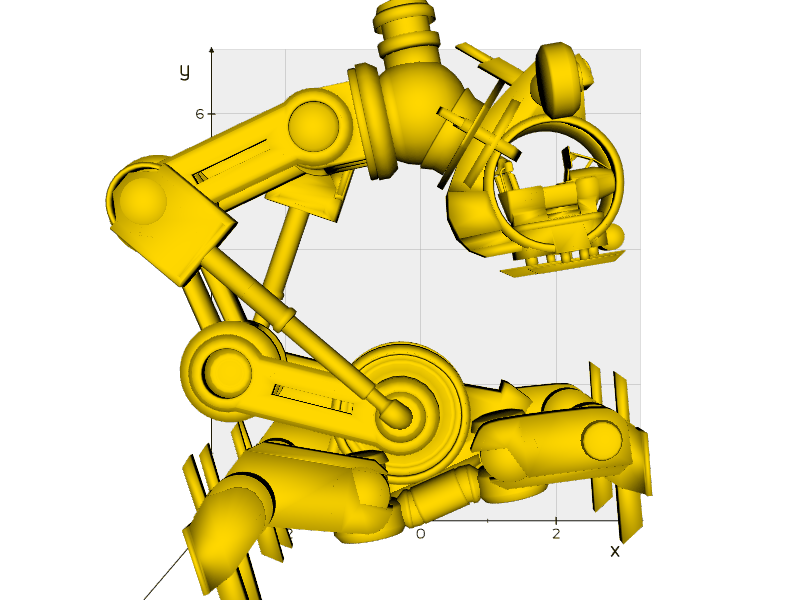

# 🧪 Taller – Construyendo el Mundo 3D

## 🔍 Descripción
Visualización de modelos 3D en formato `.OBJ` usando Python y threejs. Se analizaron estructuras como vértices, caras y aristas mediante `trimesh`, `matplotlib` y `vedo`.

## 📂 Entorno Python
- Se cargó un modelo `.obj`
- Se extrajo su geometría desde una escena (`trimesh.Scene`)
- Se visualizaron vértices en rojo y caras en azul
- Se creó una animación GIF rotando el modelo

## 📸 Resultados Python

## 📸 Resultados Threejs

## 🧠 Aprendizajes
- Diferencia entre `Scene` y `Trimesh`
- Visualización combinada de geometría
- Automatización de visualización con GIFs

## 🛠️ Librerías usadas
- trimesh
- vedo
- matplotlib
- imageio