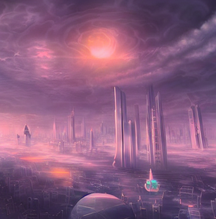
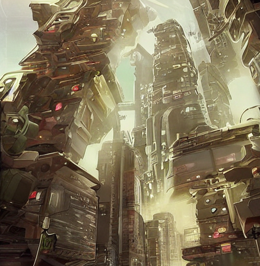
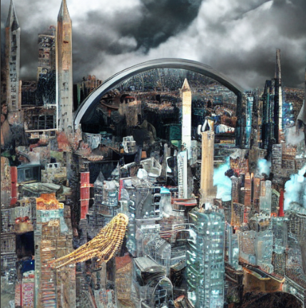
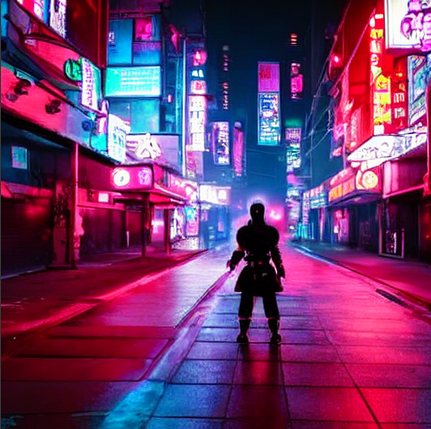
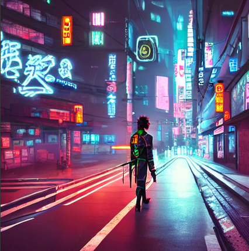
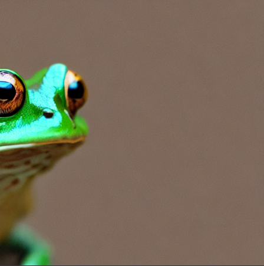

# Taller - Explorando el Universo Latente: Introducción a Stable Diffusion

##  Fecha
2025-07-12

## Plataforma
> Taller realizado en google colab, link:
https://colab.research.google.com/drive/12NVjd7J4XKkNRzwhESVt7amn22PJXj4g?usp=sharing


##  Objetivo del Taller

Explorar el funcionamiento básico de los modelos de difusión generativa, particularmente **Stable Diffusion**, y generar imágenes detalladas a partir de descripciones textuales mediante la librería `diffusers` de Hugging Face en un entorno Colab con GPU.


##  Descripción del modelo usado

Se utilizó el modelo preentrenado **`runwayml/stable-diffusion-v1-5`**, cargado a través de `diffusers`. Este modelo genera imágenes desde texto usando el principio de denoising en un espacio latente, con posibilidad de ajustar resolución, pasos de inferencia, fuerza del prompt y semilla para control de variabilidad.


##  Código relevante ejecutado

Instalación en Colab:
```python
!pip install diffusers transformers accelerate --upgrade
```

Carga del modelo:
```python
from diffusers import StableDiffusionPipeline
import torch

pipe = StableDiffusionPipeline.from_pretrained(
    "runwayml/stable-diffusion-v1-5", 
    torch_dtype=torch.float16
).to("cuda")
```

Generación de imagen:
```python
prompt = "A surreal futuristic city in the clouds, digital art"
image = pipe(prompt, num_inference_steps=50, guidance_scale=7.5).images[0]
image.save("output.png")
```

---

##  Lista de prompts utilizados

1. `"A surreal futuristic city in the clouds, digital art"`
2. `"A cyberpunk samurai walking through neon-lit streets, cinematic lighting"`
3. `"A photorealistic close-up of a frog with a crown, shallow depth of field"`

---

##  Parámetros experimentados

- `num_inference_steps`: probado con  50 y 150. A más pasos, más detalle.
- `guidance_scale`: probado con 1.5, 5.0, y 7.5 . Mayor valor, más fidelidad al prompt.
- `height`, `width`: se mantuvo resolución base (512x512).

---

## 🖼️ Evidencia visual

> Las imágenes generadas fueron guardadas como `.png` y organizadas en la carpeta `/resultados/`. Se incluyen capturas por cada prompt, comparando variaciones por estilo o parámetro.


> `guidance_scale=1.5` `num_inference_steps=50`


> `guidance_scale=1.5` `num_inference_steps=150`


>  `num_inference_steps=50`


>  `num_inference_steps=150`


>  `num_inference_steps=150`



---

## 💬 Reflexión

Este taller permitió una primera interacción con modelos de difusión generativa. Se evidenció cómo los parámetros como `guidance_scale` y el número de pasos influyen directamente en la fidelidad y nivel de detalle de la imagen. También se comprobó que los estilos artísticos como *digital art* y *cyberpunk* responden especialmente bien, mientras que prompts más abstractos o conceptuales requieren mayor ajuste fino.

---

## ✅ Checklist de entrega

- [x] Uso del modelo estable `v1-5`
- [x] Al menos 3 prompts ejecutados
- [x] Imágenes guardadas y exportadas
- [x] Variación de parámetros probada
- [x] Código ejecutado en Colab
- [x] README completo con reflexiones y evidencias

---

## 📁 Estructura del Proyecto

```
2025-07-12_taller_stable_diffusion_diffusers_colab/
├── colab_notebooks/
│   └── sd_colab_v1.ipynb
├── resultados/
│   ├── prompt_1.png
│   ├── prompt_2.png
│   ├── prompt_3.png
├── README.md
```