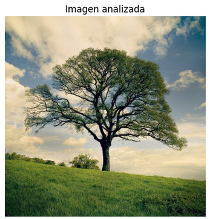
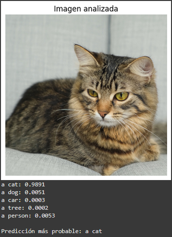

# Taller - Clasificación Visual-Verbal con CLIP

## Plataforma
> taller realizado en google colab
https://colab.research.google.com/drive/1dFyXOwoxVlT2rFxoaHolrnC72AP3tqtF?usp=sharing

##  Fecha
2025-07-12

---

##  Objetivo del Taller

Explorar el uso del modelo **CLIP (Contrastive Language-Image Pretraining)** para clasificar imágenes a partir de descripciones textuales (prompts). El objetivo es analizar cómo el modelo relaciona representaciones visuales y verbales para determinar la etiqueta más probable entre un conjunto de opciones.

---

##  Conceptos Principales

- **CLIP**: Modelo de OpenAI que relaciona texto e imágenes mediante un espacio latente compartido.
- **Clasificación Visual-Verbal**: En lugar de clasificar con redes entrenadas para categorías fijas, CLIP evalúa la similitud entre una imagen y varias descripciones textuales.
- **Embeddings de texto e imagen**: CLIP convierte ambos tipos de datos en vectores comparables mediante similitud coseno.

---

##  Código y Flujo de Trabajo

### 1. Instalación de dependencias
```python
!pip install torch torchvision torchaudio ftfy regex tqdm
!pip install git+https://github.com/openai/CLIP.git
```

### 2. Carga del modelo y librerías
```python
import clip
import torch
from PIL import Image
import matplotlib.pyplot as plt

device = "cuda" if torch.cuda.is_available() else "cpu"
model, preprocess = clip.load("ViT-B/32", device=device)
```

### 3. Clasificación de una imagen
```python
image_path = "/content/sample_data/arbol.jpg"
image = preprocess(Image.open(image_path)).unsqueeze(0).to(device)

descriptions = ["a cat", "a dog", "a car", "a tree", "a person"]
text = clip.tokenize(descriptions).to(device)

with torch.no_grad():
    image_features = model.encode_image(image)
    text_features = model.encode_text(text)
    logits_per_image, _ = model(image, text)
    probs = logits_per_image.softmax(dim=-1).cpu().numpy()[0]
```

### 4. Mostrar resultados
```python
img = Image.open(image_path)
plt.imshow(img)
plt.axis("off")
plt.title("Imagen analizada")
plt.show()

for desc, p in zip(descriptions, probs):
    print(f"{desc}: {p:.4f}")

pred_index = probs.argmax()
print("\nPredicción más probable:", descriptions[pred_index])
```

---

##  Ejemplos y Pruebas

### Imagen 1: Árbol
**Descripciones:** `["a cat", "a dog", "a car", "a tree", "a person"]`  
**Resultado:**  
```
a cat: 0.0001
a dog: 0.0003
a car: 0.0004
a tree: 0.9973
a person: 0.0019

Predicción más probable: a tree
```
**Visualización:**  


### Imagen 2: 



---

##  Tabla de Resultados (Ejemplo)

| Imagen        | a cat | a dog | a car | a tree | a person | Predicción |
|---------------|-------|-------|-------|--------|----------|------------|
| Árbol         | 0.0001| 0.0003| 0.0004| 0.9973 | 0.0019   | a tree     |
| Gato   |0.9891     |    0.0051   |  0.0003     |    0.0002    |   0.0053       |   a cat         |

---

##  Reflexión

Este taller demostró que CLIP es capaz de asociar conceptos visuales con descripciones textuales de forma robusta, incluso sin un clasificador convencional. Se observó que:
- CLIP funciona mejor con **descripciones específicas** (e.g., "a tree" vs "tree").
- El modelo distingue de manera efectiva categorías muy diferentes (como objetos vs. animales).
- La precisión depende en gran medida de la calidad y relevancia de las descripciones dadas.


##  Checklist de Entrega
- [x] Código funcional en Colab.
- [x] Imagen analizada con CLIP.
- [x] Probabilidades para múltiples descripciones.
- [x] Visualización del resultado y predicción.
- [x] README documentado.
