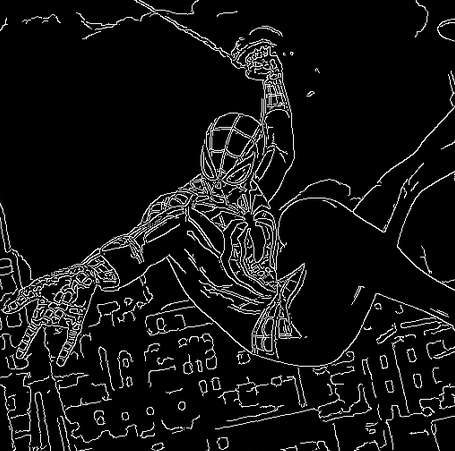
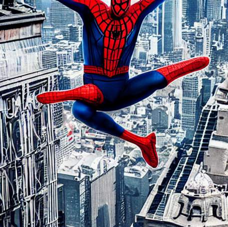

# Taller - ControlNet con Condiciones Visuales en Stable Diffusion

##  Fecha
2025-07-12

## Plataforma
https://colab.research.google.com/drive/1kMQkPcjlpIWGf8cu_TI8Zmcf3rr3i0Nu?usp=sharing

##  Objetivo del Taller

Implementar y comprender el uso de **ControlNet** sobre **Stable Diffusion**, aplicando condiciones visuales (por ejemplo, bordes detectados con Canny) para guiar la generación de imágenes a partir de descripciones textuales. Se busca explorar cómo las condiciones visuales influyen en el resultado, comparando las imágenes generadas solo con texto vs. aquellas condicionadas con ControlNet.


##  Conceptos Principales

- **Stable Diffusion**: Modelo de difusión latente para generación de imágenes a partir de texto.
- **ControlNet**: Extensión de Stable Diffusion que permite introducir información adicional (como mapas de bordes, profundidad o poses humanas) para guiar la generación.
- **Condición Visual (Canny)**: Un mapa de bordes generado a partir de una imagen de entrada, usado como referencia para la estructura de la imagen final.
- **Diffusers (Hugging Face)**: Librería para trabajar con modelos de difusión de forma modular y flexible.


##  Código y Flujo de Trabajo

### 1. Instalación en Google Colab
```python
!pip install diffusers transformers accelerate safetensors controlnet_aux
```

### 2. Carga de Modelos
```python
from diffusers import StableDiffusionControlNetPipeline, ControlNetModel
import torch

controlnet = ControlNetModel.from_pretrained("lllyasviel/sd-controlnet-canny")

pipe = StableDiffusionControlNetPipeline.from_pretrained(
    "runwayml/stable-diffusion-v1-5",
    controlnet=controlnet,
    torch_dtype=torch.float32  # Usamos float32 por compatibilidad
).to("cuda")
```

### 3. Procesamiento de Imagen de Condición (Canny)
```python
from controlnet_aux import CannyDetector
from PIL import Image

input_image = Image.open("imagenes_entrada/imagen_prueba.jpg").convert("RGB")
detector = CannyDetector()
condition_image = detector(input_image)
condition_image.save("imagenes_entrada/imagen_canny.png")
```

### 4. Generación de Imagen con ControlNet
```python
prompt = "An evil Spiderman swinging through a cyberpunk city at night, cinematic lighting"
result = pipe(
    prompt,
    image=condition_image,
    num_inference_steps=30,
    guidance_scale=7.5
).images[0]
result.save("resultados/spiderman_controlnet.png")
```

### 5. Comparación con Solo Texto
```python
from diffusers import StableDiffusionPipeline

pipe_sd = StableDiffusionPipeline.from_pretrained(
    "runwayml/stable-diffusion-v1-5",
    torch_dtype=torch.float32
).to("cuda")

image_no_control = pipe_sd(prompt, num_inference_steps=30, guidance_scale=7.5).images[0]
image_no_control.save("resultados/spiderman_solo_texto.png")
```

---

##  Ejemplos de Prompts Usados
1. *"An evil Spiderman swinging through a cyberpunk city at night, cinematic lighting"*
2. *"A futuristic samurai walking through neon-lit streets, ultra detailed"*


##  Parámetros Probados
- **`num_inference_steps`**: 20, 30 y 50 (afectan el detalle y el tiempo de generación).
- **`guidance_scale`**: 5.0, 7.5 y 10.0 (influencia del prompt sobre la imagen).
- **`float32 vs float16`**: Se usó `float32` para evitar conflictos de tipos y errores de ejecución.


##  Evidencia
> Las imágenes generadas fueron guardadas en la carpeta `/resultados/` y se comparan las diferencias entre usar solo texto y aplicar una condición visual con Canny.





##  Reflexión

Este taller permitió explorar cómo las **condiciones visuales mejoran el control estructural** de las imágenes generadas por Stable Diffusion. Se evidenció que:
- ControlNet produce imágenes más coherentes con la forma de la imagen base.
- El ajuste de parámetros como `guidance_scale` y los pasos de inferencia cambia significativamente el resultado.
- Cambiar a `float32` fue necesario en Colab para evitar errores de incompatibilidad de tipos (aunque con una ligera reducción de rendimiento).


  Checklist de Entrega
- [x] Código funcional en Colab con ControlNet.
- [x] Generación de imágenes con y sin condición visual.
- [x] Al menos 2 prompts utilizados.
- [x] Comparación y análisis de parámetros.
- [x] Evidencia visual en carpeta `/resultados/`.
- [x] README documentado.

