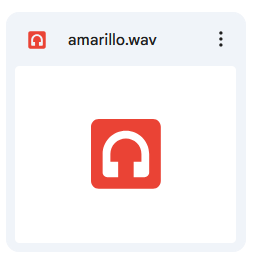
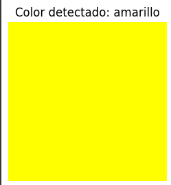
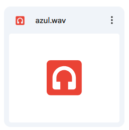
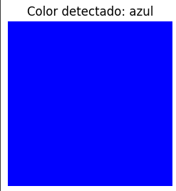

# Taller - Reconocimiento de Voz Local (Google API en Colab)

## Fecha
2025-07-24

## Objetivo del Taller
Implementar el reconocimiento de comandos de voz desde un archivo de audio en Google Colab y realizar una visualización de color en base al comando detectado.

## Conceptos Aprendidos
- Uso de la librería SpeechRecognition con el motor online de Google.
- Lectura de archivos de audio en formato WAV.
- Diccionario de comandos y mapeo a colores en formato RGB normalizado.
- Visualización de resultados con Matplotlib.

## Herramientas y Entornos
- Google Colab
- Python 3
- Librerías: `speech_recognition`, `matplotlib`, `numpy`


## Implementación

### Etapas realizadas
1. Cargar el archivo de audio (WAV) desde Google Drive.
2. Reconocer el comando de voz con `recognize_google`.
3. Asignar un color al comando detectado.
4. Generar una visualización de color con Matplotlib.

### Código relevante
```python
import speech_recognition as sr
import matplotlib.pyplot as plt
import numpy as np

audio_path = "/content/drive/MyDrive/comando_rojo.wav"

recognizer = sr.Recognizer()
with sr.AudioFile(audio_path) as source:
    audio = recognizer.record(source)

try:
    text = recognizer.recognize_google(audio, language="es-ES")
    text = text.lower().strip()
    print(f"Comando detectado: {text}")
except Exception as e:
    print(f"Error en el reconocimiento: {e}")
    text = ""

commands = {
    "rojo": (1, 0, 0),
    "azul": (0, 0, 1),
    "verde": (0, 1, 0),
    "amarillo": (1, 1, 0),
    "blanco": (1, 1, 1),
    "negro": (0, 0, 0)
}

color_found = commands.get(text, (0.5, 0.5, 0.5))
img = np.zeros((100, 100, 3))
img[:] = color_found

plt.figure(figsize=(3, 3))
plt.imshow(img)
plt.axis('off')
plt.title(f"Color detectado: {text}")
plt.show()
```

## Resultados Visuales



```

Comando detectado:amarillo
```


```

Comando detectado: azul
```

## Prompts Usados
No se usaron prompts de IA para el reconocimiento de voz. Solo se utilizó el código Python con SpeechRecognition.

## Reflexión Final
Este taller permitió entender el flujo de entrada de audio, el reconocimiento de voz con Google y la visualización dinámica de resultados. 
Fue interesante aprender cómo mapear comandos de voz a acciones visuales. Un reto fue la compatibilidad de formatos de audio, que se resolvió usando WAV.

## Checklist de Entrega
- [x] Código funcional en Google Colab.
- [x] Archivo de audio probado (WAV).
- [x] Visualización de colores correcta.
- [x] README completo y claro.
