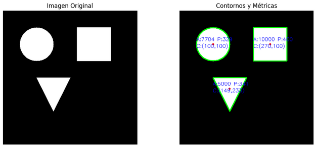

#  Taller - Análisis de Figuras Geométricas: Centroide, Área y Perímetro

##  Fecha
`2025-07-24`

## Plataforma
realizado en colab
https://colab.research.google.com/drive/1INhaTa1ZhydsyDRulYq2Vw0FTDCz2_5F?usp=sharing


##  Objetivo del Taller
Detectar formas simples (círculos, cuadrados, triángulos) en una imagen binarizada y calcular sus propiedades geométricas: **área**, **perímetro** y **centroide**, visualizando estas métricas sobre la imagen.


##  Conceptos Aprendidos
- [x] Segmentación y binarización de imágenes.
- [x] Detección de contornos con OpenCV.
- [x] Cálculo de métricas geométricas (área, perímetro, centroide).
- [x] Representación visual de métricas.


##  Herramientas y Entornos
- Python 3
- Google Colab
- Librerías: `opencv-python`, `numpy`, `matplotlib`


---

##  Implementación

###  Etapas realizadas
1. Generación de una imagen binarizada con figuras simples.
2. Detección de contornos con `cv2.findContours`.
3. Cálculo de:
   - Área con `cv2.contourArea()`
   - Perímetro con `cv2.arcLength()`
   - Centroide con `cv2.moments()`
4. Dibujo de contornos y etiquetas sobre la imagen.
5. Visualización final con `matplotlib`.

###  Código relevante
```python
for i, contour in enumerate(contours):
    area = cv2.contourArea(contour)
    perimeter = cv2.arcLength(contour, True)
    M = cv2.moments(contour)
    cx = int(M["m10"] / M["m00"]) if M["m00"] != 0 else 0
    cy = int(M["m01"] / M["m00"]) if M["m00"] != 0 else 0
    cv2.drawContours(output, [contour], -1, (0, 255, 0), 2)
    cv2.putText(output, f"A:{int(area)} P:{int(perimeter)}", (cx-50, cy-10),
                cv2.FONT_HERSHEY_SIMPLEX, 0.5, (255, 0, 0), 1)
    cv2.putText(output, f"C:({cx},{cy})", (cx-50, cy+10),
                cv2.FONT_HERSHEY_SIMPLEX, 0.5, (255, 0, 0), 1)
```


##  Resultados Visuales



##  Prompts Usados
No se usaron prompts de IA para la generación de imágenes, solo código en Python.


##  Reflexión Final
Este taller permitió reforzar el manejo de **OpenCV** para extraer métricas geométricas y trabajar con contornos. La parte más interesante fue obtener el centroide a partir de los momentos de la figura. En un futuro se podría añadir la clasificación automática de formas como mejora opcional.

---

##  Checklist de Entrega
- [x] Contornos detectados y etiquetados.
- [x] Cálculo de área, perímetro y centroide.
- [x] Imagen de resultado guardada en `resultados/`.
- [x] README completo.
