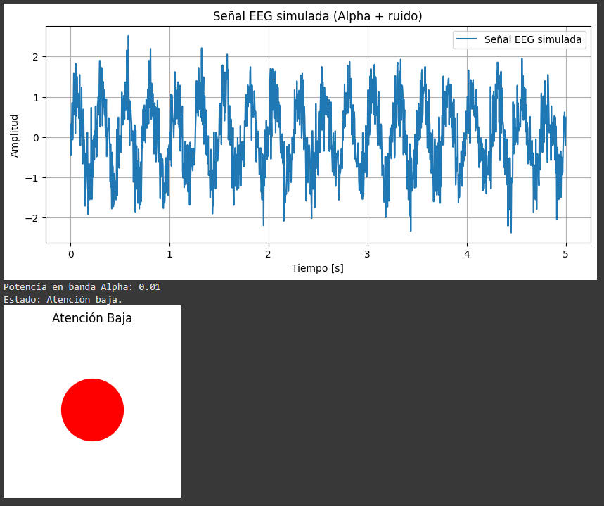
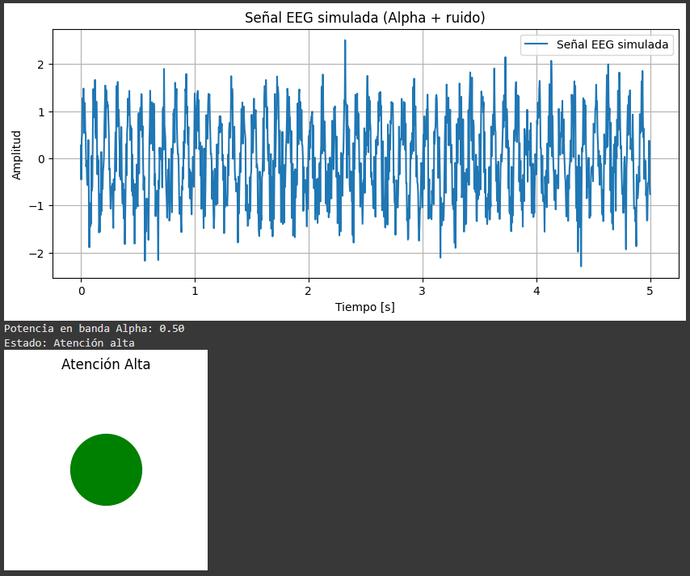

# Taller - BCI Simulado: Señales Mentales Artificiales para Control Visual

## Fecha
`2025-07-24` – Fecha de realización

## Plataforma
Taller realizado en google colab
https://colab.research.google.com/drive/1lTYLhC9tdWIheo7KfrRsO0hqKqYe5lGn?usp=sharing


## Objetivo del Taller

Simular señales EEG y aplicar filtros básicos para traducir la actividad cerebral en una acción visual, comprendiendo el flujo de procesamiento en interfaces cerebro-computador (BCI).


## Conceptos Aprendidos

- [x] Señales EEG simuladas
- [x] Filtros pasa banda (8–12 Hz)
- [x] Potencia en bandas de frecuencia
- [x] Condiciones de control para visualización
- [ ] Otro: integración en tiempo real con `pygame` (opcional)


## Herramientas y Entornos

- Python (`numpy`, `matplotlib`, `scipy.signal`)
- Google Colab


## Implementación

### Etapas realizadas
1. Simulación de una señal EEG sintética (onda alpha + ruido).
2. Visualización de la señal en el tiempo.
3. Filtrado en la banda alpha (8-12 Hz) usando Butterworth.
4. Cálculo de potencia media para determinar atención.
5. Acción visual básica: círculo verde (atención alta) o rojo (atención baja).

### Código relevante

```python
# Filtro pasa banda para banda Alpha
def bandpass_filter(data, lowcut, highcut, fs, order=4):
    nyq = 0.5 * fs
    low = lowcut / nyq
    high = highcut / nyq
    b, a = butter(order, [low, high], btype='band')
    return filtfilt(b, a, data)
```

---

## Resultados Visuales

Se generó un gráfico que muestra el cambio de color del indicador visual según el nivel de atención.





## Prompts Usados

No se utilizaron prompts de IA generativa en este taller.


## Reflexión Final

Durante el desarrollo de este taller, se comprendió cómo un flujo básico de procesamiento de señales puede replicar conceptos de BCI, desde la generación de señales simuladas hasta la creación de una acción visual sencilla.  
La etapa más interesante fue el filtrado en la banda alpha, ya que permite detectar patrones específicos en la señal. En el futuro, podría integrarse una interfaz en tiempo real para controlar elementos gráficos con mayor interactividad.


## Checklist de Entrega

- [x] Carpeta `2025-07-24_taller_bci_simulado_control_visual`
- [x] Código funcional en Colab
- [x] Visualizaciones generadas
- [x] README completo
- [x] Commits descriptivos en inglés
