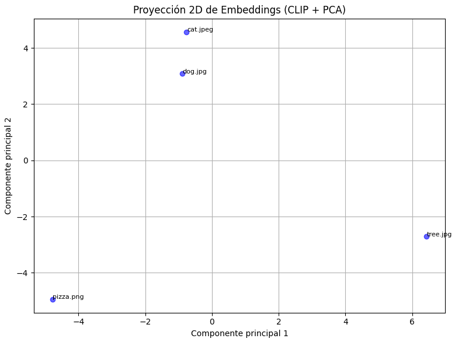
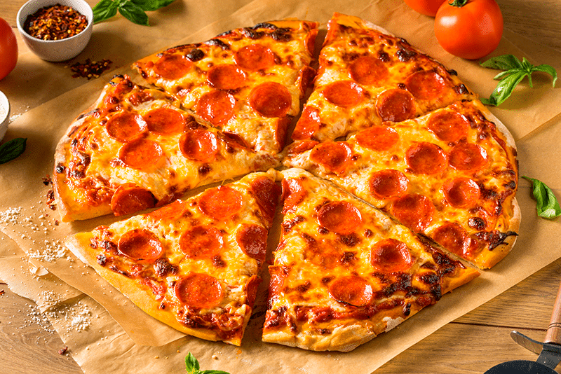

# Taller - Embeddings Visuales con CLIP y PCA

## Objetivo
Visualizar y analizar relaciones semánticas entre imágenes utilizando embeddings generados por el modelo CLIP de OpenAI, junto con una técnica de reducción de dimensionalidad (PCA). 

## Plataforma
Ejercicio realizado en google colab
https://colab.research.google.com/drive/1OXRCOpbiCGxyzKPB3dY9AyiwQPp7EXZ_?usp=sharing

---

## Proceso Realizado

### 1. Carga del modelo CLIP
- Se utilizó el modelo pre-entrenado `ViT-B/32`.
- Se aplicó el preprocesamiento estándar proporcionado por CLIP para cada imagen.

### 2. Generación de embeddings
- Cada imagen fue convertida en un vector de características de alta dimensión (embedding).
- Estos embeddings capturan las características semánticas de las imágenes.

### 3. Reducción de dimensionalidad con PCA
- Los embeddings fueron reducidos de su espacio original a dos dimensiones usando PCA.
- Esto permitió una visualización en un plano 2D.

### 4. Visualización
- Se realizó una gráfica 2D donde cada punto representa una imagen.
- Se etiquetaron los puntos con el nombre de los archivos para identificar fácilmente su posición en el espacio.

---

## Resultados
El gráfico titulado **"Proyección 2D de Embeddings (CLIP + PCA)"** muestra cómo las imágenes se distribuyen según su contenido semántico:
- Imágenes como `cat.jpeg` y `dog.jpg` aparecen relativamente cercanas porque ambos representan animales.
- Imágenes como `pizza.png` y `tree.jpg` están más alejadas debido a sus diferencias visuales.

   
---

## Observaciones
- Las imágenes con características visuales similares tienden a agruparse en el plano reducido.
- Contenidos diferentes generan mayores distancias entre los puntos.
- PCA es útil para visualizar relaciones globales, aunque implica pérdida de información al reducir las dimensiones.

---

## Reflexión
La proyección obtenida confirma que CLIP puede capturar significados y similitudes entre imágenes sin usar etiquetas explícitas. Esto lo convierte en una herramienta poderosa para tareas de agrupamiento, recuperación de imágenes y análisis exploratorio.
