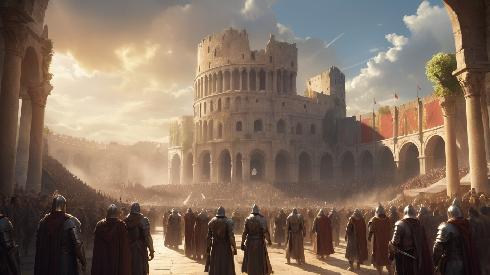
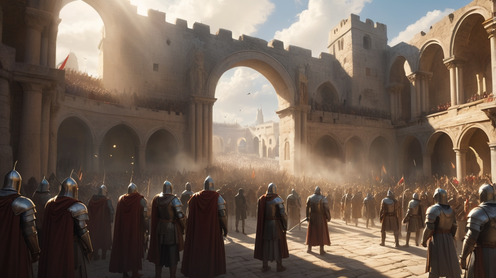
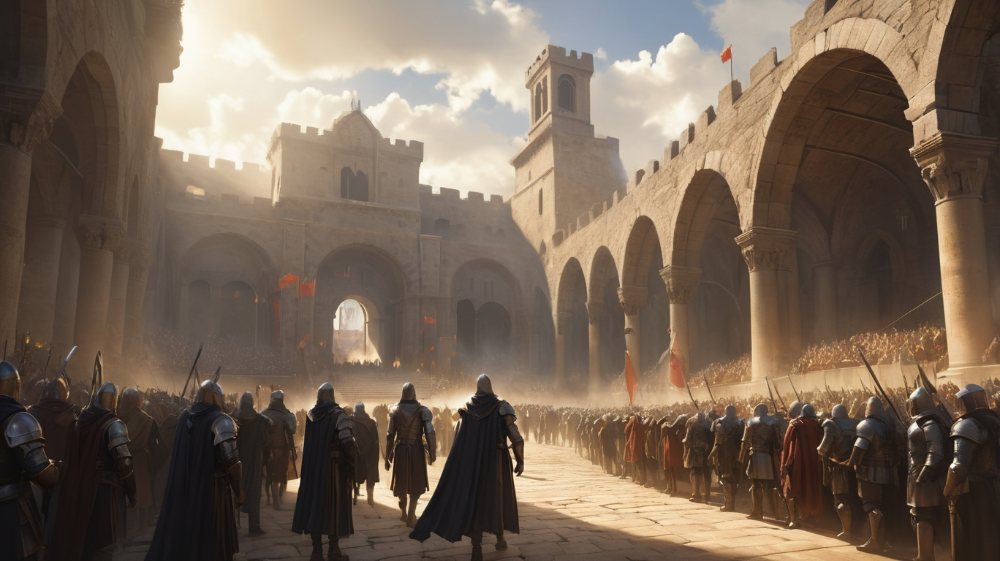
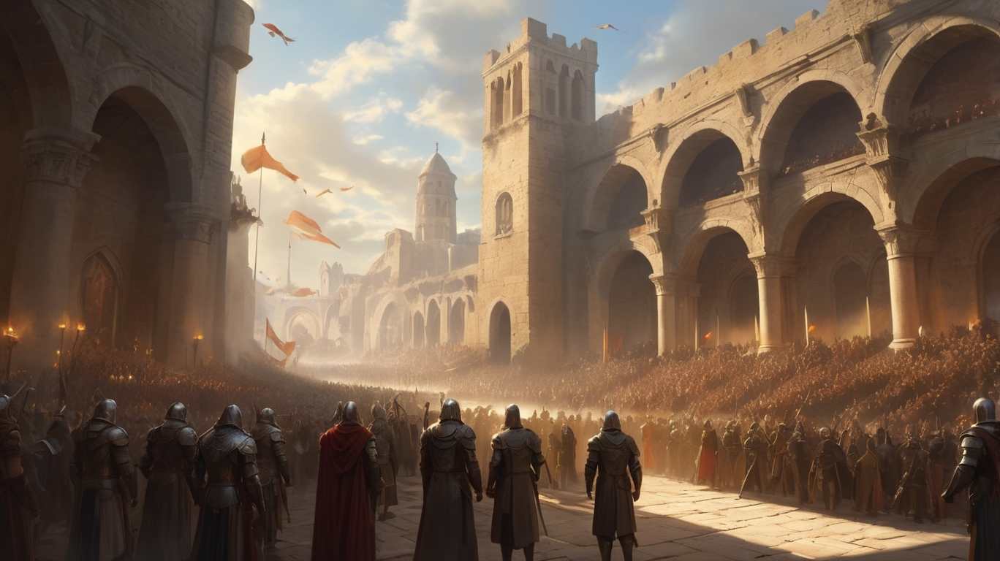

# IA Visual Web Colaborativa - Taller

## 📌 ¿Qué se detectó?
Se aplicó YOLOv8 sobre varias imagenes de prueba. Se detectaron objetos con confianza mayor al 0.5.

## 🎯 Imagenes de Prueba

## 🎯 Imagenes resultado

## 🌐 Json resultado

## 🎥 Visualización Web
Página estática que carga:
- Las imagenes con detecciones.
- Datos en una tabla extraídos del JSON por cada imagen.

## 🧠 Reflexión
Este taller me permitió entender cómo representar visualmente los resultados de un modelo IA. Publicarlos en una página web ayuda a que otros los comprendan fácilmente. Fue un reto lograr que todos los archivos se comunicaran correctamente, pero el resultado es modular y puede adaptarse a otros modelos.