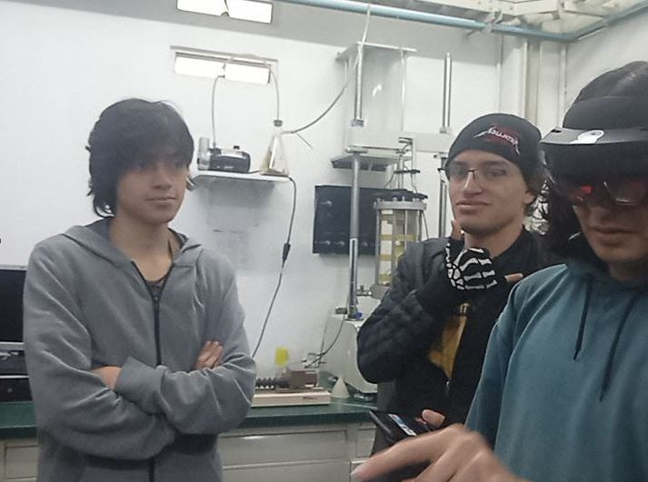

# Visual Computing – UNAL Bogotá 2025-1

This repository contains all workshop code and data for the course **Visual Computing** at the **National University of Colombia, Bogotá**, during the **2025-1 semester**.

It includes projects developed collaboratively as part of the course assignments, covering topics such as image processing, 3D format conversion, and visualization using Python, OpenCV, React Three Fiber, and Three.js.

---

## 📝 Lista de Talleres

0. [Transformaciones Básicas en Computación Visual](2025-04-15_taller0_transformaciones/README.md)
1. [Taller construyendo mundo 3d](2025-07-11_taller_construyendo_mundo_3d/README.md)
2. [Jerarquias transformaciones](2025-05-09_taller_jerarquias_transformaciones/README.md)
3. [Ojos digitales vision artificial](2025-07-11_taller_ojos_digitales/README.md)
8. [Conversion formatos 3d](2025-05-09_taller_conversion_formatos_3d/README.md)
9. [Escenas parametricas](2025-05-09_taller_escenas_parametricas/README.md)
31. [WebSockets e interacción visual en tiempo real](2025-06-15_taller_websockets_interaccion_visual_en_tiempo_real/README.md)
32. [Interpolacion movimiento animaciones](2025-06-15_taller_interpolacion_movimiento_animaciones/README.md)
33. [Animaciones esqueleto fbx gltf](2025-06-21_taller_animaciones_esqueleto_fbx_gltf/README.md)
34. [Motion design interactivo eventos](2025-06-21_taller_motion_design_interactivo_eventos/README.md)
38. [Sistema monitoreo inteligente vision dashboard](2025-07-11_taller_sistema_monitoreo_inteligente_vision_dashboard/README.md)
39. [Ia visual web colaborativa](2025-07-26_taller_ia_visual_web_colaborativa/README.md)

---

## Group Members

| Name                            | GitHub Username                                |
|---------------------------------|------------------------------------------------|
| Harrison Stiven Pinto Marulanda | [@HASPIMA](https://github.com/HASPIMA)         |
| Luis Gabriel Marin Muñoz        | [@lmarinmu](https://github.com/lmarinmu)       |        |
| Iván David Molina Leguízamo     | [@IvanMolinaL](https://github.com/IvanMolinaL) |
| Sebastian Gordillo              | ...  |

## Contents

Each folder contains a specific workshop:

## Semester

**2025-1**
National University of Colombia – Bogotá
Course: Visual Computing
