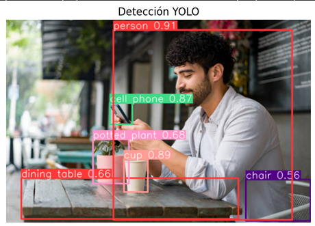
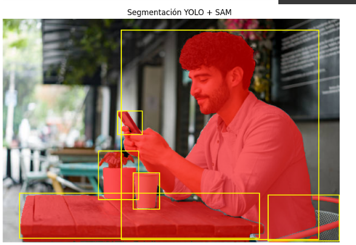
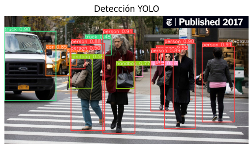
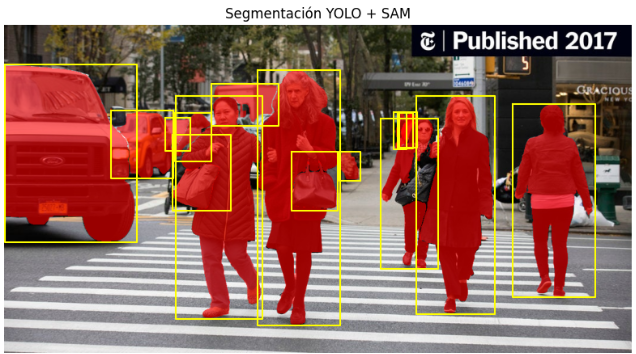

# Informe - Detección y Segmentación con YOLO + SAM

##  Fecha
2025-07-18

## Plataforma
>Taller realizado en Google Colab
link: https://colab.research.google.com/drive/1MhpjZ-KJ2MN1-2xsVsI2KnORF6-iTQYB?usp=sharing

##  Objetivo del Taller
El objetivo es integrar la detección de objetos mediante **YOLOv8** con la segmentación automática **SAM (Segment Anything Model)** para analizar escenas visuales, detectar múltiples categorías y segmentar regiones específicas en las imágenes. 


##  Descripción del Pipeline
1. **YOLOv8**: Detecta objetos en la imagen, generando *bounding boxes* y clases con sus probabilidades.
2. **SAM**: Usa las cajas de YOLO como entradas para segmentar de forma precisa los objetos detectados.
3. **Visualización combinada**: Las máscaras generadas por SAM se superponen de forma semi-transparente sobre la imagen original para una mejor interpretación.


##  Código Principal (Resumen)
```python
from ultralytics import YOLO
from segment_anything import sam_model_registry, SamPredictor
import matplotlib.pyplot as plt

# Cargar modelos
modelo_yolo = YOLO('yolov8s.pt')
sam = sam_model_registry["vit_b"](checkpoint="sam_vit_b_01ec64.pth")
predictor = SamPredictor(sam)

# Detección de objetos
results = modelo_yolo("ejemplo.jpg")

# Segmentación de objetos
predictor.set_image(image_rgb)
mask, _, _ = predictor.predict(box=box, multimask_output=False)

# Visualización con máscara semi-transparente
overlay = imagen_rgb.copy()
overlay[mask] = (0.6 * np.array([255, 0, 0]) + 0.4 * overlay[mask]).astype(np.uint8)
plt.imshow(overlay)
plt.axis('off')
plt.show()
```


##  Resultados Obtenidos

### Imagen 1: Persona con celular
**Detección YOLO:**  


**Segmentación YOLO + SAM:**  


En esta imagen se identificaron las clases: `person`, `cell phone`, `potted plant`, `cup`, `dining table`, `chair`.

### Imagen 2: Escena adicional





---

##  Pruebas y Análisis
- **Varias imágenes evaluadas:** Se realizaron pruebas en diferentes contextos (persona en terraza, calles con autos, interiores con objetos).  
- **Comparación de detección y segmentación:** Las máscaras se superponen con transparencia sobre la imagen original, ofreciendo una interpretación más clara.
- **Conteo de objetos por clase:** Por cada imagen se contabilizan los objetos detectados por YOLO.

tabla de conteo:
| Imagen | person | cell phone | cup | chair | potted plant | dining table |
|--------|--------|------------|-----|-------|--------------|--------------|
| Imagen 1 | 1 | 1 | 1 | 1 | 1 | 1 |


---

##  Reflexión
La integración de YOLO y SAM ofrece resultados robustos para análisis de imágenes, con detección rápida y segmentación precisa. Durante el proceso se evidenció que:
- Ajustar las máscaras para que se superpongan semi-transparentes facilita la interpretación.
- Se lograron resultados satisfactorios en diferentes contextos de prueba.
- El pipeline es flexible para agregar nuevos post-procesamientos, como anonimización por *blur*.


##  Checklist de Entrega
- [x] Detección con YOLOv8.
- [x] Segmentación con SAM.
- [x] Visualizaciones de los resultados.
- [x] Pruebas con varias imágenes.
- [x] Tabla de conteo por clase.
- [x] Post-procesamiento básico (superposición semi-transparente).

