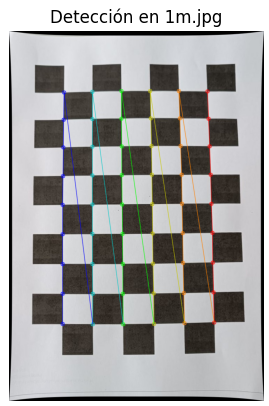
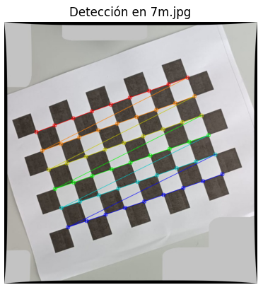
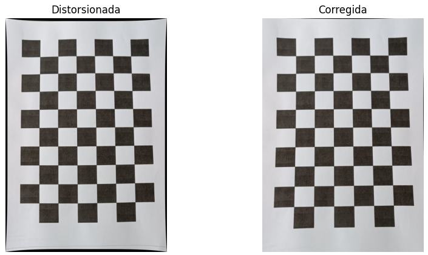
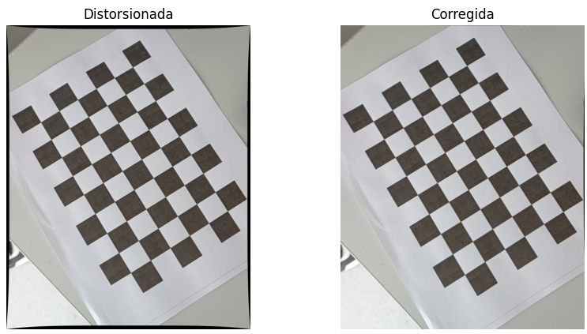
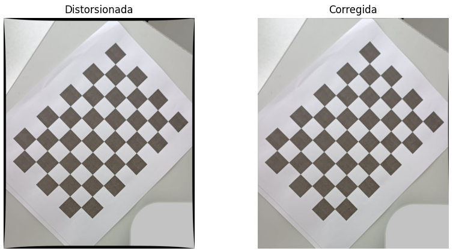

# Informe: Calibración de Cámaras y Corrección de Distorsión con OpenCV
### Grupo (8, 9)

##  Descripción

Este taller consistió en aplicar el proceso de calibración de cámaras usando un patrón de tablero de ajedrez. Se aplicó una distorsión artificial a las imágenes originales para simular defectos ópticos y luego se corrigieron utilizando los parámetros obtenidos durante la calibración.


## Paso 1: Captura de Imágenes del Patrón

Se tomaron 10 imágenes desde distintos ángulos de un tablero de ajedrez de 9x6 esquinas internas. Estas se almacenaron en la carpeta `imagenes_originales/`.

> Este patrón permite detectar puntos bien definidos que son fundamentales para estimar la geometría de la cámara.


## Paso 2: Aplicación de Distorsión Artificial

Las imágenes originales se duplicaron en la carpeta `imagenes_distorsionadas/` y se les aplicó una distorsión simulada (radial y tangencial) mediante:

```python
dist = np.array([0.2, -0.5, 0, 0, 0.1], dtype=np.float32)
```

Esto emula defectos típicos de lentes como el efecto de ojo de pez o curvatura de líneas rectas.


##  Paso 3: Detección del Patrón

Se utilizó `cv2.findChessboardCorners` para detectar las esquinas internas en las imágenes distorsionadas, y se refinaron con `cv2.cornerSubPix`:

```python
ret, corners = cv2.findChessboardCorners(gray, CHESSBOARD_SIZE, None)
```

Esto nos permite obtener las correspondencias necesarias entre puntos 3D (objp) y 2D (imgpoints).





##  Paso 4: Calibración de la Cámara

Se calcularon los parámetros de la cámara y los coeficientes de distorsión:

```python
ret, mtx, dist, rvecs, tvecs = cv2.calibrateCamera(objpoints, imgpoints, gray.shape[::-1], None, None)
```

###  Resultados

**Matriz de calibración:**
```
[[1.87732874e+03 0.00000000e+00 3.61397417e+02]
 [0.00000000e+00 1.88175481e+03 3.89004041e+02]
 [0.00000000e+00 0.00000000e+00 1.00000000e+00]]
```

**Coeficientes de distorsión:**
```
[-0.827857825, 7.08658406, 0.000942293202, 0.00480200504, -34.9019982]
```

**Error promedio de reproyección:** `0.0941`

> Este error indica que la calibración fue precisa y los puntos proyectados están muy cerca de los puntos reales.


##  Paso 5: Corrección de Imágenes

Se aplicó la corrección de distorsión con:

```python
corrected = cv2.undistort(img, mtx, dist, None, mtx)
```

Las imágenes corregidas se almacenaron en `imagenes_corregidas/`.


## 🔍 Comparaciones Visuales

A continuación se muestran ejemplos de cada paso:






##  Respuestas al Taller

**i. ¿Cuáles fueron los coeficientes de distorsión obtenidos?**  
[-0.827857825, 7.08658406, 0.000942293202, 0.00480200504, -34.9019982]

**ii. ¿Cuántas imágenes fueron necesarias para lograr una calibración aceptable?**  
Se utilizaron 10 imágenes válidas con detección exitosa del patrón.

**iii. ¿Qué diferencias se observan entre las imágenes corregidas y las distorsionadas?**  
Las corregidas eliminan las curvaturas visibles en las distorsionadas, rectificando líneas y bordes.

**iv. ¿Qué aprendiste sobre el uso del patrón de ajedrez y la calibración en visión por computador?**  
El patrón permite obtener correspondencias precisas entre coordenadas del mundo real e imagen, esenciales para calcular parámetros intrínsecos y corregir defectos ópticos.

---

**Fin del informe.**
