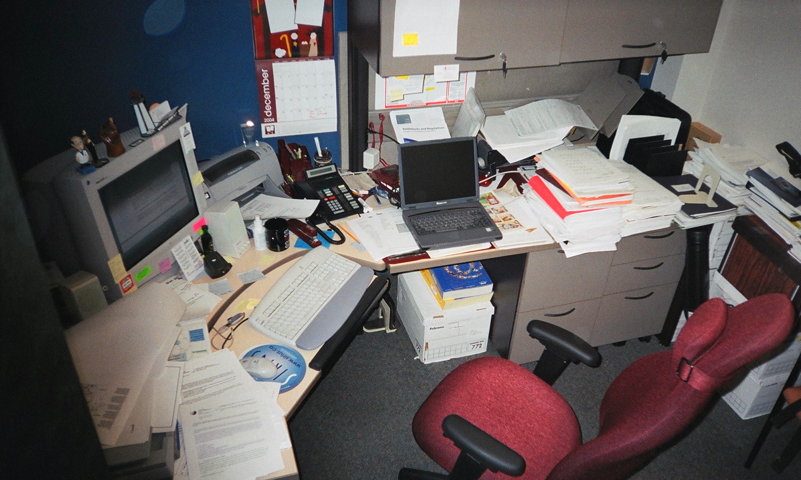
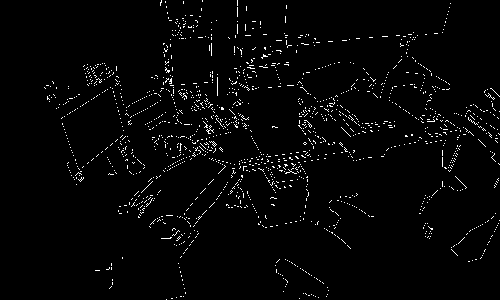
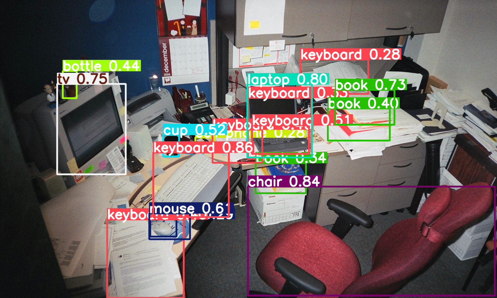

# Ejercicio 1: Procesamiento de Imagen y Detección con YOLO

## Tabla de contenidos

- [Ejercicio 1: Procesamiento de Imagen y Detección con YOLO](#ejercicio-1-procesamiento-de-imagen-y-detección-con-yolo)
  - [Tabla de contenidos](#tabla-de-contenidos)
  - [Descripción](#descripción)
  - [Actividades](#actividades)
  - [Resultados](#resultados)
    - [Imagen suavizada](#imagen-suavizada)
    - [Bordes detectados](#bordes-detectados)
    - [Detección de objetos (YOLO)](#detección-de-objetos-yolo)

## Descripción

A partir de la imagen proporcionada por el docente, realice el procesamiento de imagen y la detección de objetos.

## Actividades

1. Cargar la imagen en Python con OpenCV.
2. Aplicar un filtro de suavizado (Gaussiano o Mediana).
3. Aplicar un filtro de detección de bordes (Sobel o Canny).
4. Visualizar las tres etapas:

   - Imagen original
   - Imagen suavizada
   - Bordes detectados

5. Detectar objetos con YOLOv5 o YOLOv8 (modelo preentrenado).
6. Mostrar imagen con bounding boxes y etiquetas.

## Resultados

### Imagen suavizada

### Bordes detectados

### Detección de objetos (YOLO)

