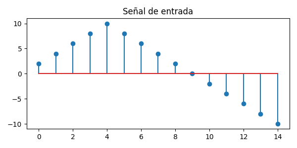
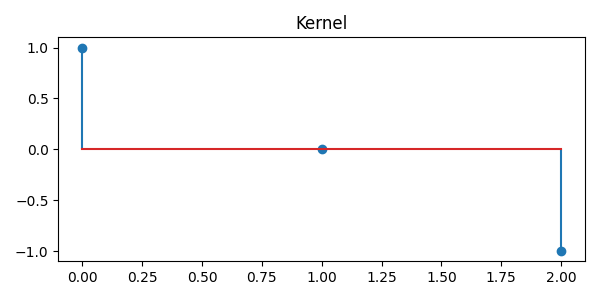
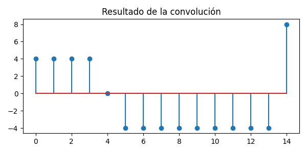

# Ejercicio 3: Convolución Unidimensional en Python

## Tabla de contenidos

- [Ejercicio 3: Convolución Unidimensional en Python](#ejercicio-3-convolución-unidimensional-en-python)
  - [Tabla de contenidos](#tabla-de-contenidos)
  - [Descripción](#descripción)
  - [Actividades](#actividades)
  - [Instrucciones para correr el proyecto](#instrucciones-para-correr-el-proyecto)
  - [Resultados](#resultados)

## Descripción

Implementar desde cero una función en Python que realice una
convolución 1D entre una señal y un kernel.

## Actividades

1. Definir una señal de entrada de 10 a 20 valores.
2. Definir un kernel de tamaño 3 (ej. `[1, 0, -1]` o
`[1/3, 1/3, 1/3]`).
3. Implementar la función de convolución
**sin usar `numpy.convolve`**.
4. Graficar la señal, el kernel y el resultado con `matplotlib`.

## Instrucciones para correr el proyecto

Se está haciendo uso de [uv](https://docs.astral.sh/uv/). Por lo tanto
sólo es necesario ejecutar:

```sh
uv run convolucion.py
```

## Resultados

A continuación se muestran los gráficos generados por el script:

**Señal original:**



**Kernel:**



**Resultado de la convolución:**


